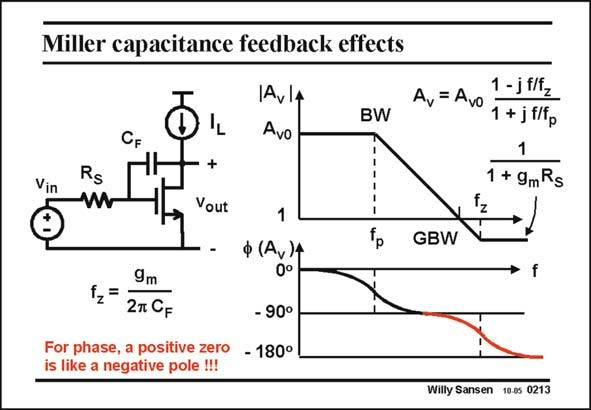

# SANSEN-0213 · Miller capacitance feedback effects

章节：02 放大器、源极跟随器与共源共栅级  
PDF 页：56；书本页：57；幻灯片编号：0213  
状态：unreviewed



## Spectre 仿真

本推导组的代表模型已完成 Spectre 验证；覆盖范围以所列网表为准，未逐一搭建所有幻灯片电路。

[本组波形与仿真报告](../../simulations/ch02/index.html#03-miller)

## 第二章公式推导

保留跨接电容的反馈与前馈，得到完整传输及单极点近似的成立条件。

[完整 Markdown 解释](../../derivations/ch02/03-miller.md) · [排版公式网页](../../derivations/ch02/03-miller.html)

状态：derived_in_stated_model；SFG：used。电压／电流混合节点；CF 电流、跨导电流和电阻压降分别建边，逐项追溯局部约束。

模型、近似与来源差异以新推导页为准；下方保留第一步的原始抽取。

## 对应教材讲解

### PDF 56 · 书本 57

Actually, a Miller capacitance also causes a zero in the transfer characteristic. A full small-signal analysis reveals that the pole (the BW) is followed by a zero at high frequencies. It is a positive zero. It occurs at the right hand side of the polar diagram. It causes a −180° phase shift at higher frequencies. A −180° phase shift would also be caused by a second pole. We come to the remarkable result that a single capacitance can cause the same phase shift as two poles. Normally only one single pole is attributed per capacitance. This is a truly exceptional situation indeed.

## 公式／性能结论候选摘录

以下为规则截取的原文，尚未逐项判读。

（未由规则找到；不代表原页没有此类内容。）

## 曲线结论候选摘录

以下为规则截取的原文，尚未逐项判读。

- PDF 56: Actually, a Miller capacitance also causes a zero in the transfer characteristic.
- PDF 56: It causes a −180° phase shift at higher frequencies.
- PDF 56: A −180° phase shift would also be caused by a second pole.
- PDF 56: We come to the remarkable result that a single capacitance can cause the same phase shift as two poles.

## 原文条件与近似候选摘录

以下为规则截取的原文，尚未逐项判读。

（未由规则找到；不代表原页没有此类内容。）

## 幻灯片 OCR（未校正）

```text
Miller capacitance feedback effects
1AVlA
CF
Avo
Vin
Rs
+
Vout
Av= Avo
1-jflfz
BW
1 + jf/fp
1
1 + 9mRs
,N
9m
27 CF
For phase, a positive zero
is like a negative pole !!!
1
ф (Av)4
0°
- 90°
- 180°
GBW
Willy Sansen 10.05 0213
```

数学上下标、分数及正负号以原图为准。电路图已保留；未核对的连接不输出成可仿真 netlist。
