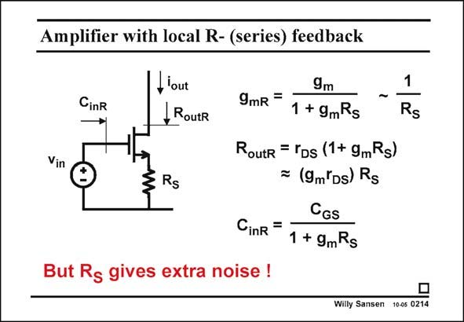

# SANSEN-0214 · Amplifier with local R- (series) feedback

章节：02 放大器、源极跟随器与共源共栅级  
PDF 页：56；书本页：57；幻灯片编号：0214  
状态：unreviewed



## Spectre 仿真

本推导组的代表模型已完成 Spectre 验证；覆盖范围以所列网表为准，未逐一搭建所有幻灯片电路。

[本组波形与仿真报告](../../simulations/ch02/index.html#04-degeneration)

## 第二章公式推导

保留有限输出电阻；区分负反馈阻抗、信号源电阻与线性区 MOS 的栅极响应。

[完整 Markdown 解释](../../derivations/ch02/04-degeneration.md) · [排版公式网页](../../derivations/ch02/04-degeneration.html)

状态：derived_in_stated_model；SFG：not_needed。此组以微分、KCL 或矩阵即可说明机制，没有必要另画 SFG。

模型、近似与来源差异以新推导页为准；下方保留第一步的原始抽取。

## 对应教材讲解

### PDF 56 · 书本 57

Quite often, local series feedback is applied to a singletransistor amplifier, by means of a resistor R . In S principle, the effect of this resistor can be calculated by common feedback theory (see Chapter 13). The so called loop gain is then (1+g R ). It affects all m S other circuit specifications. It is a very simple case however, which allows us to calculate all these effects directly. The transconductance is reduced by this loop gain. For large resistors, the transconductance is reduced to 1/R . It is S independent of the current in contrast with g . m A major effect is that the output resistance increases drastically. Indeed, it goes up by the same loop gain. An easy way to remember this expression is to take the series resistor R , S multiplied by the intrinsic transistor gain itself g R . m DS This increased output resistance will be used to increase the gain! The input capacitance is decreased by the feedback. The larger the resistor R , the smaller the S input capacitance. If R were replaced by a DC current source, the input capacitance would be S negligible. Actually, the gain would be negligible as well. This is a source follower, as discussed later.

### PDF 57 · 书本 58

The main problem of R is its noise. This is why in low-noise RF circuits, an inductor is S used instead.

## 公式／性能结论候选摘录

以下为规则截取的原文，尚未逐项判读。

- PDF 56: The so called loop gain is then (1+g R ).
- PDF 56: The transconductance is reduced by this loop gain.
- PDF 56: It is S independent of the current in contrast with g . m A major effect is that the output resistance increases drastically.
- PDF 56: Indeed, it goes up by the same loop gain.
- PDF 56: An easy way to remember this expression is to take the series resistor R , S multiplied by the intrinsic transistor gain itself g R . m DS This increased output resistance will be used to increase the gain!
- PDF 56: The input capacitance is decreased by the feedback.
- PDF 56: Actually, the gain would be negligible as well.

## 曲线结论候选摘录

以下为规则截取的原文，尚未逐项判读。

（未由规则找到；不代表原页没有此类内容。）

## 原文条件与近似候选摘录

以下为规则截取的原文，尚未逐项判读。

（未由规则找到；不代表原页没有此类内容。）

## 幻灯片 OCR（未校正）

```text
Amplifier with local R- (series) feedback
CinR
Vin
I'out
, RoutR
Rs
9m
9mR =
1 + 9mRs
-
Routr = EDs (1+ 9mRs)
= (9m'Ds) Rs
CGS
CinR =
1 + 9mRs
1
Rs
But Rs gives extra noise !
Willy Sansen 10-05 0214
```

数学上下标、分数及正负号以原图为准。电路图已保留；未核对的连接不输出成可仿真 netlist。
