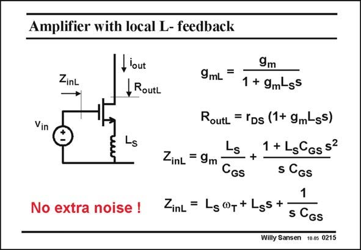

# SANSEN-0215 · Amplifier with local L- feedback

章节：02 放大器、源极跟随器与共源共栅级  
PDF 页：57；书本页：58；幻灯片编号：0215  
状态：unreviewed



## Spectre 仿真

本推导组的代表模型已完成 Spectre 验证；覆盖范围以所列网表为准，未逐一搭建所有幻灯片电路。

[本组波形与仿真报告](../../simulations/ch02/index.html#04-degeneration)

## 第二章公式推导

保留有限输出电阻；区分负反馈阻抗、信号源电阻与线性区 MOS 的栅极响应。

[完整 Markdown 解释](../../derivations/ch02/04-degeneration.md) · [排版公式网页](../../derivations/ch02/04-degeneration.html)

状态：derived_in_stated_model；SFG：not_needed。此组以微分、KCL 或矩阵即可说明机制，没有必要另画 SFG。

模型、近似与来源差异以新推导页为准；下方保留第一步的原始抽取。

## 对应教材讲解

### PDF 57 · 书本 58

Inductors and capacitances do not give noise, at least not as long as their series loss resistance is zero. Only resistances give noise among the passives! Inserting an inductor makes both the transconductance and the output resistance frequency dependent. The input impedance Z inL however, which was capacitive without series R or L, becomes now purely resistive with value g L /C or m S GS L v . Indeed, the input capacitance C is tuned out by the inductor. Its input resistance can S T GS be easily designed to be 50 V to match an incoming 50 V transmission line (cable, antenna, etc.). In this way, a very-high-frequency low-noise amplifier can be designed (see Chapter 23).

## 公式／性能结论候选摘录

以下为规则截取的原文，尚未逐项判读。

- PDF 57: Inserting an inductor makes both the transconductance and the output resistance frequency dependent.

## 曲线结论候选摘录

以下为规则截取的原文，尚未逐项判读。

（未由规则找到；不代表原页没有此类内容。）

## 原文条件与近似候选摘录

以下为规则截取的原文，尚未逐项判读。

（未由规则找到；不代表原页没有此类内容。）

## 幻灯片 OCR（未校正）

```text
Amplifier with local L- feedback
ZinL
lout
, Routl
Vin
Ls
No extra noise !
9m
9mL
=
1 + 9m-ss
RoutL
.=rDs (1+ 9m-ss)
Ls
1 + LsGGs52
ZinL = 9m
CGs
+
s CGs
1
ZinL = Lg@r+Lgs+•
sGGS
Willy Sansen 10.05 0215
```

数学上下标、分数及正负号以原图为准。电路图已保留；未核对的连接不输出成可仿真 netlist。
