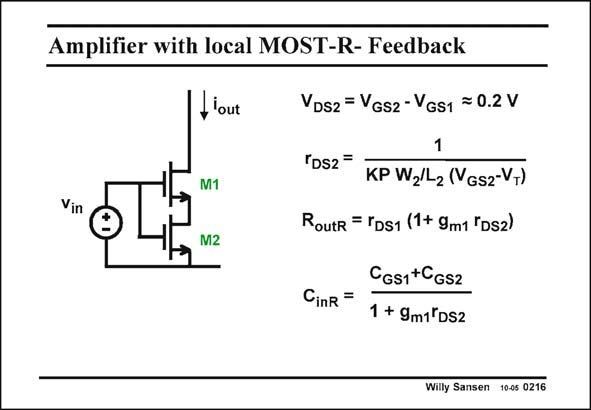

# SANSEN-0216 · Amplifier with local MOST-R- Feedback

章节：02 放大器、源极跟随器与共源共栅级  
PDF 页：57；书本页：58；幻灯片编号：0216  
状态：unreviewed



## Spectre 仿真

本推导组的代表模型已完成 Spectre 验证；覆盖范围以所列网表为准，未逐一搭建所有幻灯片电路。

[本组波形与仿真报告](../../simulations/ch02/index.html#04-degeneration)

## 第二章公式推导

保留有限输出电阻；区分负反馈阻抗、信号源电阻与线性区 MOS 的栅极响应。

[完整 Markdown 解释](../../derivations/ch02/04-degeneration.md) · [排版公式网页](../../derivations/ch02/04-degeneration.html)

状态：derived_with_source_notes；SFG：not_needed。此组以微分、KCL 或矩阵即可说明机制，没有必要另画 SFG。

模型、近似与来源差异以新推导页为准；下方保留第一步的原始抽取。

## 对应教材讲解

### PDF 57 · 书本 58

An easy way to realize such a series feedback resistor is to use a nMOST in the linear region. This is only possible however, if its V DS2 is quite small, between 100 and 200 mV. This is also the difference between the V ’s GS of the two transistors. It is not that easy to track the parameters of both transistors. Indeed, MOST M1 works in saturation, involving parameter K∞, whereas transistor M2 operates as a resistor, with parameter KP. They differ by parameter n, which is always uncertain.

## 公式／性能结论候选摘录

以下为规则截取的原文，尚未逐项判读。

（未由规则找到；不代表原页没有此类内容。）

## 曲线结论候选摘录

以下为规则截取的原文，尚未逐项判读。

（未由规则找到；不代表原页没有此类内容。）

## 原文条件与近似候选摘录

以下为规则截取的原文，尚未逐项判读。

- PDF 57: Indeed, MOST M1 works in saturation, involving parameter K∞, whereas transistor M2 operates as a resistor, with parameter KP.

## 幻灯片 OCR（未校正）

```text
Amplifier with local MOST-R- Feedback
Vin
II'out
M1
M2
VDs2 = VGs2 - Vgs1 = 0.2 V
1
TDs2=
KP W,/L2 (Vgs2-VT)
Routr = TDS1 (1+ 9m1 "Ds2)
CinR =
CGs1+CGs2
1 + 9m1 DS2
Willy Sansen 10-05 0216
```

数学上下标、分数及正负号以原图为准。电路图已保留；未核对的连接不输出成可仿真 netlist。
