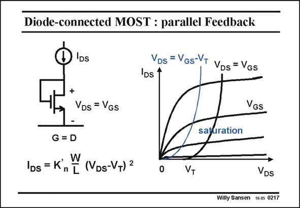

# SANSEN-0217 · Diode-connected MOST : parallel Feedback

章节：02 放大器、源极跟随器与共源共栅级  
PDF 页：58；书本页：59；幻灯片编号：0217  
状态：unreviewed



## Spectre 仿真

本推导组的代表模型已完成 Spectre 验证；覆盖范围以所列网表为准，未逐一搭建所有幻灯片电路。

[本组波形与仿真报告](../../simulations/ch02/index.html#05-diode-loads)

## 第二章公式推导

由负载的小信号导纳推导增益、带宽、体效应与 DC 平衡限制。

[完整 Markdown 解释](../../derivations/ch02/05-diode-loads.md) · [排版公式网页](../../derivations/ch02/05-diode-loads.html)

状态：derived_in_stated_model；SFG：not_needed。此组以微分、KCL 或矩阵即可说明机制，没有必要另画 SFG。

模型、近似与来源差异以新推导页为准；下方保留第一步的原始抽取。

## 对应教材讲解

### PDF 58 · 书本 59

Parallel feedback can be applied to a single transistor as well, which results in a diode-connected transistor. Connecting collector to base in a bipolar transistor, gives us a real base-emitter diode. In a MOST however, there is no gate-source diode. And yet, connecting the drain to the gate gives us something similar. Indeed the current voltage characteristic is obtained by shifting the curve, separating the linear and the saturation region, which is at V =V −V , to the right by V . DS GS T T As a result, we can indeed use the current-voltage characteristic of a MOST in saturation. The resulting curve is very nonlinear however. It resembles somewhat, a diode characteristic. We will use this simple circuit to convert current to voltage.

## 公式／性能结论候选摘录

以下为规则截取的原文，尚未逐项判读。

- PDF 58: DS GS T T As a result, we can indeed use the current-voltage characteristic of a MOST in saturation.

## 曲线结论候选摘录

以下为规则截取的原文，尚未逐项判读。

- PDF 58: Indeed the current voltage characteristic is obtained by shifting the curve, separating the linear and the saturation region, which is at V =V −V , to the right by V .
- PDF 58: DS GS T T As a result, we can indeed use the current-voltage characteristic of a MOST in saturation.
- PDF 58: The resulting curve is very nonlinear however.
- PDF 58: It resembles somewhat, a diode characteristic.

## 原文条件与近似候选摘录

以下为规则截取的原文，尚未逐项判读。

- PDF 58: Indeed the current voltage characteristic is obtained by shifting the curve, separating the linear and the saturation region, which is at V =V −V , to the right by V .
- PDF 58: DS GS T T As a result, we can indeed use the current-voltage characteristic of a MOST in saturation.

## 幻灯片 OCR（未校正）

```text
Diode-connected MOST : parallel Feedback
)IDs
+
VDs = VGs
G = D
VDs = VGs-VT
VDs =VGs
IDs 1
VGS
saturation
lps = K',
W
n T (VDs-VT) 2
VT
VDs
Willy Sansen 10.0s 0217
```

数学上下标、分数及正负号以原图为准。电路图已保留；未核对的连接不输出成可仿真 netlist。
