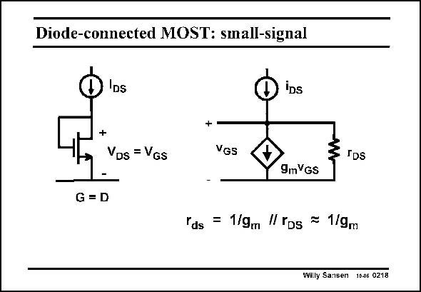

# SANSEN-0218 · Diode-connected MOST: small-signal

章节：02 放大器、源极跟随器与共源共栅级  
PDF 页：58；书本页：59；幻灯片编号：0218  
状态：unreviewed



## Spectre 仿真

本推导组的代表模型已完成 Spectre 验证；覆盖范围以所列网表为准，未逐一搭建所有幻灯片电路。

[本组波形与仿真报告](../../simulations/ch02/index.html#05-diode-loads)

## 第二章公式推导

由负载的小信号导纳推导增益、带宽、体效应与 DC 平衡限制。

[完整 Markdown 解释](../../derivations/ch02/05-diode-loads.md) · [排版公式网页](../../derivations/ch02/05-diode-loads.html)

状态：derived_in_stated_model；SFG：not_needed。此组以微分、KCL 或矩阵即可说明机制，没有必要另画 SFG。

模型、近似与来源差异以新推导页为准；下方保留第一步的原始抽取。

## 对应教材讲解

### PDF 58 · 书本 59

If we add a small-signal current to the DC current, then we find the small-signal equivalent circuit, as shown. The small-signal resistance r is then 1/g in pards m allel with the transistor output resistance r . Since DS the latter one is always significantly larger than 1/g , m it can be simplified to 1/g m itself. The small-signal resistance of a diode connected MOST is thus always 1/g , m very much as for a bipolar transistor.

## 公式／性能结论候选摘录

以下为规则截取的原文，尚未逐项判读。

- PDF 58: The small-signal resistance of a diode connected MOST is thus always 1/g , m very much as for a bipolar transistor.

## 曲线结论候选摘录

以下为规则截取的原文，尚未逐项判读。

（未由规则找到；不代表原页没有此类内容。）

## 原文条件与近似候选摘录

以下为规则截取的原文，尚未逐项判读。

（未由规则找到；不代表原页没有此类内容。）

## 幻灯片 OCR（未校正）

```text
Diode-connected MOST: small-signal
IDs
iDs
+
VDs = VGs
VGs
3 IDs
9mVgS
G = D
rds
= 1/9m // rps = 1/9m
Willy Sansen 10.06 0218
```

数学上下标、分数及正负号以原图为准。电路图已保留；未核对的连接不输出成可仿真 netlist。
