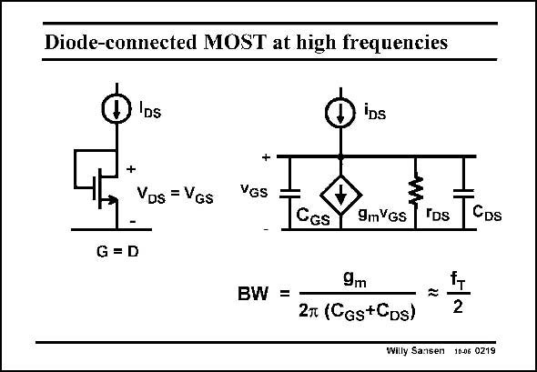

# SANSEN-0219 · Diode-connected MOST at high frequencies

章节：02 放大器、源极跟随器与共源共栅级  
PDF 页：59；书本页：60；幻灯片编号：0219  
状态：unreviewed



## Spectre 仿真

本推导组的代表模型已完成 Spectre 验证；覆盖范围以所列网表为准，未逐一搭建所有幻灯片电路。

[本组波形与仿真报告](../../simulations/ch02/index.html#05-diode-loads)

## 第二章公式推导

由负载的小信号导纳推导增益、带宽、体效应与 DC 平衡限制。

[完整 Markdown 解释](../../derivations/ch02/05-diode-loads.md) · [排版公式网页](../../derivations/ch02/05-diode-loads.html)

状态：derived_in_stated_model；SFG：not_needed。此组以微分、KCL 或矩阵即可说明机制，没有必要另画 SFG。

模型、近似与来源差异以新推导页为准；下方保留第一步的原始抽取。

## 对应教材讲解

### PDF 58 · 书本 59

At high frequencies, this voltage-to-current converter performs quite well. Indeed adding the C and C , which are the two most important capacitances of a MOST, GS DS

### PDF 59 · 书本 60

yields a bandwidth BW, which is quite high. This BW is determined by 1/g m and the sum of the two capacitances. These capacitances are very similar in size however. They have been taken to be equal in size. The bandwidth is thus well approximated by f /2. T For a high bandwidth, we must therefore design a transistor with high f , T which requires a large V −V and minimum GS T channel length L.

## 公式／性能结论候选摘录

以下为规则截取的原文，尚未逐项判读。

- PDF 59: yields a bandwidth BW, which is quite high.
- PDF 59: They have been taken to be equal in size.
- PDF 59: The bandwidth is thus well approximated by f /2.
- PDF 59: T For a high bandwidth, we must therefore design a transistor with high f , T which requires a large V −V and minimum GS T channel length L.

## 曲线结论候选摘录

以下为规则截取的原文，尚未逐项判读。

（未由规则找到；不代表原页没有此类内容。）

## 原文条件与近似候选摘录

以下为规则截取的原文，尚未逐项判读。

- PDF 59: The bandwidth is thus well approximated by f /2.

## 幻灯片 OCR（未校正）

```text
Diode-connected MOST at high frequencies
IDs
VDs = VGs
+
VGs
CGs
9mYGs TDs
CDs
G = D
BW =
9m
2л (Cgs+CDs)
=
2
Willy Sansen 10.06 0219
```

数学上下标、分数及正负号以原图为准。电路图已保留；未核对的连接不输出成可仿真 netlist。
