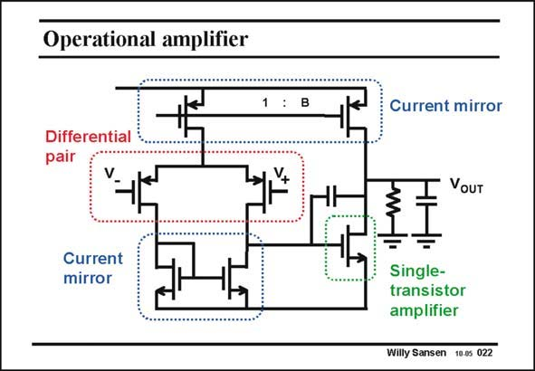

# SANSEN-022 · Operational amplifier

章节：02 放大器、源极跟随器与共源共栅级  
PDF 页：50；书本页：51；幻灯片编号：022  
状态：unreviewed



## 第二章公式推导

本章单管、跟随器与共源共栅级的架构导览；各拓扑映射至后续推导。

[完整 Markdown 解释](../../derivations/ch02/00-conventions.md) · [排版公式网页](../../derivations/ch02/00-conventions.html)

状态：context_reviewed_no_independent_derivation；SFG：not_applicable。本页为章节脉络，无独立小信号模型需建图。

模型、近似与来源差异以新推导页为准；下方保留第一步的原始抽取。

## 对应教材讲解

### PDF 50 · 书本 51

In all analog electronics, an operational amplifier is the most versatile circuit block. It consists of a differential input and a single output. Its gain is very large. It is normally used in a feedback loop. A simple realization is shown in this slide. Such an operational amplifier, usually shortened to opamp, contains several elementary building blocks. In the first stage we can identify a differential pair loaded by a current mirror. The second stage is little more than a single-transistor amplifier, with a DC current source as load, which is also part of a current mirror. These elementary building blocks will now be studied in great detail.

## 公式／性能结论候选摘录

以下为规则截取的原文，尚未逐项判读。

- PDF 50: Its gain is very large.

## 曲线结论候选摘录

以下为规则截取的原文，尚未逐项判读。

（未由规则找到；不代表原页没有此类内容。）

## 原文条件与近似候选摘录

以下为规则截取的原文，尚未逐项判读。

（未由规则找到；不代表原页没有此类内容。）

## 幻灯片 OCR（未校正）

```text
Operational amplifier
1 : B
Differential
pair
Current
mirror
Current mirror
VOUT
Single-
transistor
amplifier
Willy Sansen 10.0s 022
```

数学上下标、分数及正负号以原图为准。电路图已保留；未核对的连接不输出成可仿真 netlist。
