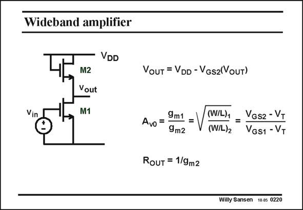

# SANSEN-0220 · Wideband amplifier

章节：02 放大器、源极跟随器与共源共栅级  
PDF 页：59；书本页：60；幻灯片编号：0220  
状态：unreviewed



## Spectre 仿真

本推导组的代表模型已完成 Spectre 验证；覆盖范围以所列网表为准，未逐一搭建所有幻灯片电路。

[本组波形与仿真报告](../../simulations/ch02/index.html#05-diode-loads)

## 第二章公式推导

由负载的小信号导纳推导增益、带宽、体效应与 DC 平衡限制。

[完整 Markdown 解释](../../derivations/ch02/05-diode-loads.md) · [排版公式网页](../../derivations/ch02/05-diode-loads.html)

状态：derived_in_stated_model；SFG：not_needed。此组以微分、KCL 或矩阵即可说明机制，没有必要另画 SFG。

模型、近似与来源差异以新推导页为准；下方保留第一步的原始抽取。

## 对应教材讲解

### PDF 59 · 书本 60

As a load for this amplifier, a resistor can be used. In this case however, the gain is very low, somewhere between 3 and 5, depending on the supply voltage. Suitable resistors are not always available. In a digital CMOS process, none of them can provide reasonably large resistance values. This is why many circuit schematics have been proposed, using MOSTs as loads. One of them is shown in this slide. It uses a nMOST connected as a diode. Its small-signal resistance is thus 1/g . The gain is m2 the ratio of the transconductances. It is small but fairly accurate as it is mainly set by the ratio of the transistor sizes. Its main advantage is that no pMOSTs are used. This amplifier can achieve high bandwidths, also because the output impedance is quite small! Its main disadvantage is that the DC output voltage is connected to the supply line over the V . Because of the body effect of transistor M2, this DC output voltage is not well defined. GS2 The biasing of the next stage may suffer from this.

## 公式／性能结论候选摘录

以下为规则截取的原文，尚未逐项判读。

- PDF 59: In this case however, the gain is very low, somewhere between 3 and 5, depending on the supply voltage.
- PDF 59: Its small-signal resistance is thus 1/g .
- PDF 59: The gain is m2 the ratio of the transconductances.

## 曲线结论候选摘录

以下为规则截取的原文，尚未逐项判读。

（未由规则找到；不代表原页没有此类内容。）

## 原文条件与近似候选摘录

以下为规则截取的原文，尚未逐项判读。

（未由规则找到；不代表原页没有此类内容。）

## 幻灯片 OCR（未校正）

```text
Wideband amplifier
VDD
Vin
M2
Vout
M1
VouT = VDD - VGs2(VouT)
Avo = 9m1
=
9m2
RouT = 1/9m2
(W/L) = Vos2 - VT
(W/L)2
VGS1 - VT
Willy Sansen 10.0s 0220
```

数学上下标、分数及正负号以原图为准。电路图已保留；未核对的连接不输出成可仿真 netlist。
