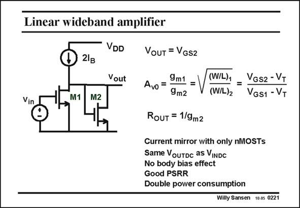

# SANSEN-0221 · Linear wideband amplifier

章节：02 放大器、源极跟随器与共源共栅级  
PDF 页：60；书本页：61；幻灯片编号：0221  
状态：unreviewed



## Spectre 仿真

本推导组的代表模型已完成 Spectre 验证；覆盖范围以所列网表为准，未逐一搭建所有幻灯片电路。

[本组波形与仿真报告](../../simulations/ch02/index.html#05-diode-loads)

## 第二章公式推导

由负载的小信号导纳推导增益、带宽、体效应与 DC 平衡限制。

[完整 Markdown 解释](../../derivations/ch02/05-diode-loads.md) · [排版公式网页](../../derivations/ch02/05-diode-loads.html)

状态：derived_with_source_notes；SFG：not_needed。此组以微分、KCL 或矩阵即可说明机制，没有必要另画 SFG。

模型、近似与来源差异以新推导页为准；下方保留第一步的原始抽取。

## 对应教材讲解

### PDF 60 · 书本 61

A better solution for the biasing is shown in this slide. There is a DC input voltage which gives rise to an equal DC output voltage. In this case the current is divided over both transistors and the gain is accurately given by the transistor size ratio or the V −V ratio’s. GS T An additional advantage is that the circuit can easily be put in series with many more similar stages. This may be needed because the gain is small. A transistor ratio of 25 gives only a gain of 5. For larger gains, several more stages like this have to be cascaded. The body effect does not apply a role any more as all bulk contacts are grounded. Again only nMOSTs are used for higher frequency performance. The main drawback of this amplifier solution is that the current consumption is twice that of the previous circuit. However, it is quite often used as a wideband amplifier, in optical receivers, etc.

## 公式／性能结论候选摘录

以下为规则截取的原文，尚未逐项判读。

- PDF 60: There is a DC input voltage which gives rise to an equal DC output voltage.
- PDF 60: In this case the current is divided over both transistors and the gain is accurately given by the transistor size ratio or the V −V ratio’s.
- PDF 60: This may be needed because the gain is small.
- PDF 60: A transistor ratio of 25 gives only a gain of 5.

## 曲线结论候选摘录

以下为规则截取的原文，尚未逐项判读。

（未由规则找到；不代表原页没有此类内容。）

## 原文条件与近似候选摘录

以下为规则截取的原文，尚未逐项判读。

（未由规则找到；不代表原页没有此类内容。）

## 幻灯片 OCR（未校正）

```text
Linear wideband amplifier
VDD
Д 2g
VouT = VGsz
Vout
Avo = 9m1 .
9m2
Vin
M1
M2
(W/L)1
=
VGs2 - VT
(W/L)2
VGS1 - VT
RouT = 1/9m2
Current mirror with only nMOSTs
Same VouTDc as VINDC
No body bias effect
Good PSRR
Double power consumption
Willy Sansen 10.0s 0221
```

数学上下标、分数及正负号以原图为准。电路图已保留；未核对的连接不输出成可仿真 netlist。
