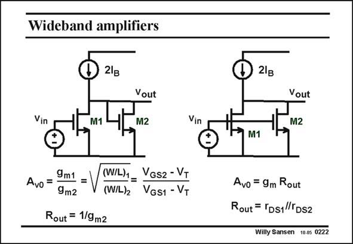

# SANSEN-0222 · Wideband amplifiers

章节：02 放大器、源极跟随器与共源共栅级  
PDF 页：60；书本页：61；幻灯片编号：0222  
状态：unreviewed



## Spectre 仿真

本推导组的代表模型已完成 Spectre 验证；覆盖范围以所列网表为准，未逐一搭建所有幻灯片电路。

[本组波形与仿真报告](../../simulations/ch02/index.html#05-diode-loads)

## 第二章公式推导

由负载的小信号导纳推导增益、带宽、体效应与 DC 平衡限制。

[完整 Markdown 解释](../../derivations/ch02/05-diode-loads.md) · [排版公式网页](../../derivations/ch02/05-diode-loads.html)

状态：derived_in_stated_model；SFG：not_needed。此组以微分、KCL 或矩阵即可说明机制，没有必要另画 SFG。

模型、近似与来源差异以新推导页为准；下方保留第一步的原始抽取。

## 对应教材讲解

### PDF 60 · 书本 61

The question arises which amplifier would be better, the first one or the second, where the same current is used but now with transistor M2 in parallel with M1? Clearly in the second amplifier, the output resistance is higher and so is the gain. Accordingly, the bandwidth will be smaller. Let us have a closer look at this amplifier. Normally the current source is realized by means of another transistor, a pMOST device, the gate of which is connected to a voltage reference, which sets all DC currents. We still have two possibilities as shown next.

## 公式／性能结论候选摘录

以下为规则截取的原文，尚未逐项判读。

- PDF 60: Clearly in the second amplifier, the output resistance is higher and so is the gain.
- PDF 60: Accordingly, the bandwidth will be smaller.

## 曲线结论候选摘录

以下为规则截取的原文，尚未逐项判读。

（未由规则找到；不代表原页没有此类内容。）

## 原文条件与近似候选摘录

以下为规则截取的原文，尚未逐项判读。

（未由规则找到；不代表原页没有此类内容。）

## 幻灯片 OCR（未校正）

```text
Wideband amplifiers
21g
Vin
M1
Vout
M2
Vin
9m1
Avo =
=V
(W/L)1_ Vos2 - VT
9m2
(W/L)2
VGs1- VT
Rout = 1/9m2
21в
Vout
M1
Avo = 9m Rout
Rout = [DS1|TDS2
Willy Sansen 10.05 0222
```

数学上下标、分数及正负号以原图为准。电路图已保留；未核对的连接不输出成可仿真 netlist。
