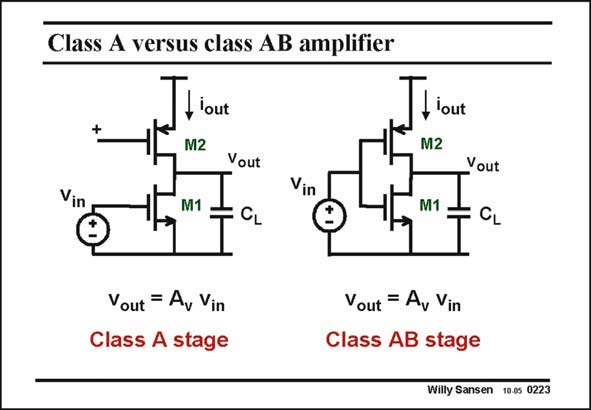

# SANSEN-0223 · Class A versus class AB amplifier

章节：02 放大器、源极跟随器与共源共栅级  
PDF 页：61；书本页：62；幻灯片编号：0223  
状态：unreviewed



## Spectre 仿真

本推导组的代表模型已完成 Spectre 验证；覆盖范围以所列网表为准，未逐一搭建所有幻灯片电路。

[本组波形与仿真报告](../../simulations/ch02/index.html#06-inverter-dc)

## 第二章公式推导

分开 NMOS／PMOS 的电流，求总跨导与有限输出导纳下的增益。

[完整 Markdown 解释](../../derivations/ch02/06-inverter-dc.md) · [排版公式网页](../../derivations/ch02/06-inverter-dc.html)

状态：derived_in_stated_model；SFG：not_needed。此组以微分、KCL 或矩阵即可说明机制，没有必要另画 SFG。

模型、近似与来源差异以新推导页为准；下方保留第一步的原始抽取。

## 对应教材讲解

### PDF 61 · 书本 62

The first amplifier has a constant DC current as the gate of current source transistor M2 is connected to a DC reference. At low frequencies, the load capacitance C L does not apply. In this case, the DC current through transistors M1 and M2 does not change with the signal level. It is by definition a class A amplifier. The result is very different if we connect and drive both gates together. Depending on the input signal level, the currents in both transistors varies greatly. It is a class AB amplifier. Actually, this amplifier is used for both digital and analog input signals.

## 公式／性能结论候选摘录

以下为规则截取的原文，尚未逐项判读。

- PDF 61: Depending on the input signal level, the currents in both transistors varies greatly.

## 曲线结论候选摘录

以下为规则截取的原文，尚未逐项判读。

（未由规则找到；不代表原页没有此类内容。）

## 原文条件与近似候选摘录

以下为规则截取的原文，尚未逐项判读。

（未由规则找到；不代表原页没有此类内容。）

## 幻灯片 OCR（未校正）

```text
Class A versus class AB amplifier
Tour
+
M2
Vin
Vout
M1
CL
Vin
f iout
M2
M1
Vout
CL
Vout = A, Vin
Class A stage
Vout = A, Vin
Class AB stage
Willy Sansen 10.05 0223
```

数学上下标、分数及正负号以原图为准。电路图已保留；未核对的连接不输出成可仿真 netlist。
