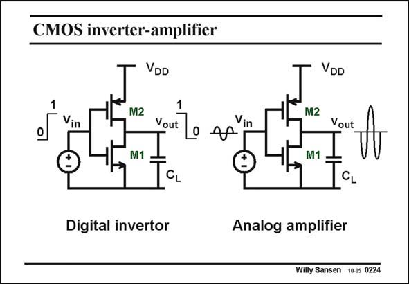

# SANSEN-0224 · CMOS inverter-amplifier

章节：02 放大器、源极跟随器与共源共栅级  
PDF 页：61；书本页：62；幻灯片编号：0224  
状态：unreviewed



## Spectre 仿真

本推导组的代表模型已完成 Spectre 验证；覆盖范围以所列网表为准，未逐一搭建所有幻灯片电路。

[本组波形与仿真报告](../../simulations/ch02/index.html#06-inverter-dc)

## 第二章公式推导

分开 NMOS／PMOS 的电流，求总跨导与有限输出导纳下的增益。

[完整 Markdown 解释](../../derivations/ch02/06-inverter-dc.md) · [排版公式网页](../../derivations/ch02/06-inverter-dc.html)

状态：derived_in_stated_model；SFG：not_needed。此组以微分、KCL 或矩阵即可说明机制，没有必要另画 SFG。

模型、近似与来源差异以新推导页为准；下方保留第一步的原始抽取。

## 对应教材讲解

### PDF 61 · 书本 62

Indeed, this is the well known digital inverter. When the input goes high (from a digital 0 to 1), the output goes low, and viceversa. In both cases, no current can flow. This is the main advantage of this digital inverter. It only consumes power during switching. Many millions can now be integrated on a single silicon chip, without excessive heat dissipation. As an analog amplifier, the input biasing voltage is such that the output voltage sits at an acceptable value between the supply voltage V and DD ground. A small-signal input voltage is then amplified (and inverted) to the output. This is examined in more detail next.

## 公式／性能结论候选摘录

以下为规则截取的原文，尚未逐项判读。

（未由规则找到；不代表原页没有此类内容。）

## 曲线结论候选摘录

以下为规则截取的原文，尚未逐项判读。

（未由规则找到；不代表原页没有此类内容。）

## 原文条件与近似候选摘录

以下为规则截取的原文，尚未逐项判读。

（未由规则找到；不代表原页没有此类内容。）

## 幻灯片 OCR（未校正）

```text
CMOS inverter-amplifier
VDD
VDD
1
1
Vin
M2
M1
Vout
Vin
_M2
M1 =
Vout
CL
Digital invertor
CL
Analog amplifier
Willy Sansen 10.05 0224
```

数学上下标、分数及正负号以原图为准。电路图已保留；未核对的连接不输出成可仿真 netlist。
