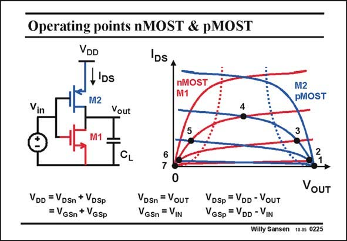

# SANSEN-0225 · Operating points nMOST & pMOST

章节：02 放大器、源极跟随器与共源共栅级  
PDF 页：62；书本页：63；幻灯片编号：0225  
状态：unreviewed



## Spectre 仿真

本推导组的代表模型已完成 Spectre 验证；覆盖范围以所列网表为准，未逐一搭建所有幻灯片电路。

[本组波形与仿真报告](../../simulations/ch02/index.html#06-inverter-dc)

## 第二章公式推导

分开 NMOS／PMOS 的电流，求总跨导与有限输出导纳下的增益。

[完整 Markdown 解释](../../derivations/ch02/06-inverter-dc.md) · [排版公式网页](../../derivations/ch02/06-inverter-dc.html)

状态：derived_in_stated_model；SFG：not_needed。此组以微分、KCL 或矩阵即可说明机制，没有必要另画 SFG。

模型、近似与来源差异以新推导页为准；下方保留第一步的原始抽取。

## 对应教材讲解

### PDF 61 · 书本 62

In order to establish the actual transfer curve and the transistor currents, we have to realize that both transistors always carry the same DC current. Indeed, no DC current can escape through the capacitance. This is also true for AC currents at low frequencies.

### PDF 62 · 书本 63

Also, note that the sum of the V ’s is V , and that DS DD the sum of the V ’s is also GS V . For a low input volt- DD age, the V is also low and GSn the V is high. In this case, GSp the nMOST is off and the pMOST is on. The crossing point of their I −V DS DS curves is thus at point 1. Indeed the pMOST is biased as a small resistor, and the output voltage is the same as the supply voltage. Increasing the input voltage will cause the crossing point to shift from point 1, to 2, and so on, all the way to point 7. At this latter point the pMOST is off and the nMOST has a large V , but small V . It is in the linear region and so behaves as a small resistor. The GS DS output voltage is now zero. The transistor currents are zero as well. When the input voltage is about halfway, the transistor current flows, and the output voltage is about halfway as well. This is point 4. This is the normal biasing for this circuit as an analog amplifier.

## 公式／性能结论候选摘录

以下为规则截取的原文，尚未逐项判读。

- PDF 62: The crossing point of their I −V DS DS curves is thus at point 1.

## 曲线结论候选摘录

以下为规则截取的原文，尚未逐项判读。

- PDF 61: In order to establish the actual transfer curve and the transistor currents, we have to realize that both transistors always carry the same DC current.
- PDF 62: The crossing point of their I −V DS DS curves is thus at point 1.

## 原文条件与近似候选摘录

以下为规则截取的原文，尚未逐项判读。

（未由规则找到；不代表原页没有此类内容。）

## 幻灯片 OCR（未校正）

```text
Operating points nMOST & pMOST
VDD
t'os
M2
DS
nMOST
M1
Vin
Vout
4
M2
pMOST
5
CL
VDD =VDsn + VDsp
= VGSn + VGSp
7
0
VDSn = VouT
VGSn = VIN
VoUT
VDsp = VDD- VouT
VGSp = VDD -VIN
Willy Sansen 10.05 0225
```

数学上下标、分数及正负号以原图为准。电路图已保留；未核对的连接不输出成可仿真 netlist。
