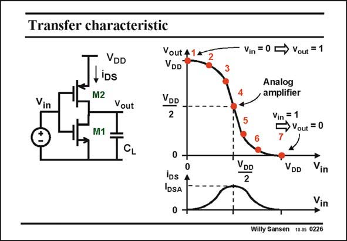

# SANSEN-0226 · Transfer characteristic Vin = 0 5

章节：02 放大器、源极跟随器与共源共栅级  
PDF 页：62；书本页：63；幻灯片编号：0226  
状态：unreviewed



## Spectre 仿真

本推导组的代表模型已完成 Spectre 验证；覆盖范围以所列网表为准，未逐一搭建所有幻灯片电路。

[本组波形与仿真报告](../../simulations/ch02/index.html#06-inverter-dc)

## 第二章公式推导

分开 NMOS／PMOS 的电流，求总跨导与有限输出导纳下的增益。

[完整 Markdown 解释](../../derivations/ch02/06-inverter-dc.md) · [排版公式网页](../../derivations/ch02/06-inverter-dc.html)

状态：derived_in_stated_model；SFG：not_needed。此组以微分、KCL 或矩阵即可说明机制，没有必要另画 SFG。

模型、近似与来源差异以新推导页为准；下方保留第一步的原始抽取。

## 对应教材讲解

### PDF 62 · 书本 63

The transfer characteristic is now easily reconstructed. It is a plot of the output voltage versus input voltage. For each input voltage, the output voltage is found by the points 1 to 7 and added to the plot. The corresponding transistor current is added underneath. It is clear that no current flows in the points 1 and 7, when the output is at a digital ‘‘1’’ or ‘‘0’’. The current reaches its maximum in the middle. This current is denoted by I . The analog amplifier is always biased in this point. It is its DSA quiescent current. The exact calculation of the whole transfer characteristic is not that easy. It is only easy in the extreme points 1, 4 and 7. This exact calculation is better left to a circuit simulator such as SPICE. We now concentrate on this amplifier, biased in the middle point 4.

## 公式／性能结论候选摘录

以下为规则截取的原文，尚未逐项判读。

（未由规则找到；不代表原页没有此类内容。）

## 曲线结论候选摘录

以下为规则截取的原文，尚未逐项判读。

- PDF 62: The transfer characteristic is now easily reconstructed.
- PDF 62: It is a plot of the output voltage versus input voltage.
- PDF 62: For each input voltage, the output voltage is found by the points 1 to 7 and added to the plot.
- PDF 62: The exact calculation of the whole transfer characteristic is not that easy.

## 原文条件与近似候选摘录

以下为规则截取的原文，尚未逐项判读。

（未由规则找到；不代表原页没有此类内容。）

## 幻灯片 OCR（未校正）

```text
Transfer characteristic
VDD
LiDs
M2
Vin
Vout
Vout 4
VDD
DD
2
M1
CL
0
IDs
IDSA
Vin = 0 5
•Vout = 1
Analog
amplifier
Vin
Vout = 0
VDD
VDD
Vin
Vin
Willy Sansen 10.0s 0226
```

数学上下标、分数及正负号以原图为准。电路图已保留；未核对的连接不输出成可仿真 netlist。
