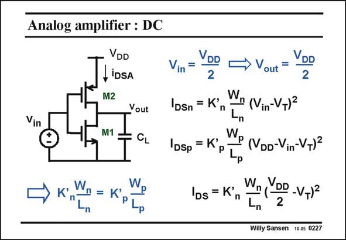

# SANSEN-0227 · Analog amplifier : DC

章节：02 放大器、源极跟随器与共源共栅级  
PDF 页：63；书本页：64；幻灯片编号：0227  
状态：unreviewed



## Spectre 仿真

本推导组的代表模型已完成 Spectre 验证；覆盖范围以所列网表为准，未逐一搭建所有幻灯片电路。

[本组波形与仿真报告](../../simulations/ch02/index.html#06-inverter-dc)

## 第二章公式推导

分开 NMOS／PMOS 的电流，求总跨导与有限输出导纳下的增益。

[完整 Markdown 解释](../../derivations/ch02/06-inverter-dc.md) · [排版公式网页](../../derivations/ch02/06-inverter-dc.html)

状态：derived_in_stated_model；SFG：not_needed。此组以微分、KCL 或矩阵即可说明机制，没有必要另画 SFG。

模型、近似与来源差异以新推导页为准；下方保留第一步的原始抽取。

## 对应教材讲解

### PDF 63 · 书本 64

We firstly have to determine the exact biasing. We normally require the output voltage to be half the supply voltage, when the input voltage is half the supply voltage. It does not have to be like that, but this is a better way, for example, if several of these stages have to cascaded. In this case, both transistors have the same V , GS which is V /2. They also DD have the same current. This is only possible if their W/L values are inversely proportional to their K∞ values. Since K∞ is usually twice as large as K∞ , n p the pMOST transistor has usually twice the W/L value compared to the nMOST. The expression of the transistor current is then easily obtained, with V substituted by V /2. GS DD

## 公式／性能结论候选摘录

以下为规则截取的原文，尚未逐项判读。

- PDF 63: This is only possible if their W/L values are inversely proportional to their K∞ values.

## 曲线结论候选摘录

以下为规则截取的原文，尚未逐项判读。

（未由规则找到；不代表原页没有此类内容。）

## 原文条件与近似候选摘录

以下为规则截取的原文，尚未逐项判读。

（未由规则找到；不代表原页没有此类内容。）

## 幻灯片 OCR（未校正）

```text
Analog amplifier : DC
Vil
VDD
LiDSA
M2
Vout
M1
CL
Vin
=
DSn
=
DSp
K'
→ K',
W
-n
W.
= K'
P
P
-p
IDs = K'
> Vout
DD
2
(Vin-VT)2
W.
P (VDD-Vin-V+)2
"P
Wn,
DD
-VT)2
-n
2
Willy Sansen 10.05 0227
```

数学上下标、分数及正负号以原图为准。电路图已保留；未核对的连接不输出成可仿真 netlist。
