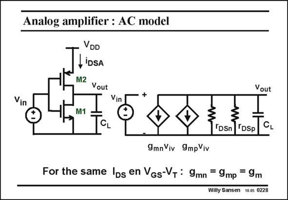

# SANSEN-0228 · Analog amplifier : AC model

章节：02 放大器、源极跟随器与共源共栅级  
PDF 页：63；书本页：64；幻灯片编号：0228  
状态：unreviewed



## Spectre 仿真

本推导组的代表模型已完成 Spectre 验证；覆盖范围以所列网表为准，未逐一搭建所有幻灯片电路。

[本组波形与仿真报告](../../simulations/ch02/index.html#07-inverter-ac)

## 第二章公式推导

以二节点矩阵保留输入、输出与跨接电容，核对单管／总跨导的系数。

[完整 Markdown 解释](../../derivations/ch02/07-inverter-ac.md) · [排版公式网页](../../derivations/ch02/07-inverter-ac.html)

状态：derived_in_stated_model；SFG：not_needed。此组以微分、KCL 或矩阵即可说明机制，没有必要另画 SFG。

模型、近似与来源差异以新推导页为准；下方保留第一步的原始抽取。

## 对应教材讲解

### PDF 63 · 书本 64

In order to obtain the expression of the voltage gain, we need to draw the small-signal equivalent circuit of this amplifier. Note that the supply voltage is always AC ground. Also note that both transistors have equal small-signal models and even equal transconductances. It is clear from this smallsignal circuit, that both transistors are actually in parallel, for small-signal operation (for DC operation or biasing they are in series). They provide equal contributions to the small-signal output current and to the gain. The total transconductance is thus twice the transconductance of a single transistor.

## 公式／性能结论候选摘录

以下为规则截取的原文，尚未逐项判读。

- PDF 63: In order to obtain the expression of the voltage gain, we need to draw the small-signal equivalent circuit of this amplifier.
- PDF 63: Also note that both transistors have equal small-signal models and even equal transconductances.
- PDF 63: They provide equal contributions to the small-signal output current and to the gain.
- PDF 63: The total transconductance is thus twice the transconductance of a single transistor.

## 曲线结论候选摘录

以下为规则截取的原文，尚未逐项判读。

（未由规则找到；不代表原页没有此类内容。）

## 原文条件与近似候选摘录

以下为规则截取的原文，尚未逐项判读。

（未由规则找到；不代表原页没有此类内容。）

## 幻灯片 OCR（未校正）

```text
Vin
Analog amplifier : AC model
VDD
LiDSA
M2 Vout
Vin
M1
Vout
CL
"DSn
TDSp
CL
9mn Viv
9mpViv
For the same Ibs en Vgs-VT : 9mn = 9mp = 9m
Willy Sansen 10.05 0228
```

数学上下标、分数及正负号以原图为准。电路图已保留；未核对的连接不输出成可仿真 netlist。
