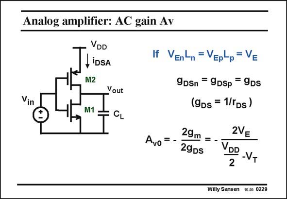

# SANSEN-0229 · Analog amplifier: AC gain Av

章节：02 放大器、源极跟随器与共源共栅级  
PDF 页：64；书本页：65；幻灯片编号：0229  
状态：unreviewed



## Spectre 仿真

本推导组的代表模型已完成 Spectre 验证；覆盖范围以所列网表为准，未逐一搭建所有幻灯片电路。

[本组波形与仿真报告](../../simulations/ch02/index.html#07-inverter-ac)

## 第二章公式推导

以二节点矩阵保留输入、输出与跨接电容，核对单管／总跨导的系数。

[完整 Markdown 解释](../../derivations/ch02/07-inverter-ac.md) · [排版公式网页](../../derivations/ch02/07-inverter-ac.html)

状态：derived_with_source_notes；SFG：not_needed。此组以微分、KCL 或矩阵即可说明机制，没有必要另画 SFG。

模型、近似与来源差异以新推导页为准；下方保留第一步的原始抽取。

## 对应教材讲解

### PDF 63 · 书本 64

In order to calculate the gain at low frequencies, we need to know the output resistance. It is the parallel combination of both output resistances. This is highest when both resistances are

### PDF 64 · 书本 65

equal. This is why normally both V L products are also E made the same. The total output resistance is then r /2, also written as 2/g . DS DS The voltage gain is then simply given by the product of the total transconductance with the total output resistance, which is g /g . m DS This can easily be rewritten as shown in this slide. Note that the current is not included, a result which we had found already for a single-transistor amplifier. This is not surprising as here we have two transistors in parallel, for small-signal operation. Also note, that the voltage gain goes up when the supply voltage goes down. An optimum supply voltage is thus found where the V values are about 0.2 V. This supply voltage is thus GS 2(V +0.2), which is 1.1 V for a V of 0.35 V. In deep submicron CMOS this is quite a reasonable T T value indeed! If the supply voltage is larger, only small values of the gain are possible. More complicated circuits are then needed to enhance the voltage gain. Cascodes can be used for example, and gain-boosting, but also bootstrapping and current-cancellation and -starving techniques.

## 公式／性能结论候选摘录

以下为规则截取的原文，尚未逐项判读。

- PDF 63: In order to calculate the gain at low frequencies, we need to know the output resistance.
- PDF 64: equal.
- PDF 64: DS DS The voltage gain is then simply given by the product of the total transconductance with the total output resistance, which is g /g . m DS This can easily be rewritten as shown in this slide.
- PDF 64: Also note, that the voltage gain goes up when the supply voltage goes down.
- PDF 64: An optimum supply voltage is thus found where the V values are about 0.2 V.
- PDF 64: This supply voltage is thus GS 2(V +0.2), which is 1.1 V for a V of 0.35 V.
- PDF 64: If the supply voltage is larger, only small values of the gain are possible.
- PDF 64: More complicated circuits are then needed to enhance the voltage gain.

## 曲线结论候选摘录

以下为规则截取的原文，尚未逐项判读。

（未由规则找到；不代表原页没有此类内容。）

## 原文条件与近似候选摘录

以下为规则截取的原文，尚未逐项判读。

（未由规则找到；不代表原页没有此类内容。）

## 幻灯片 OCR（未校正）

```text
Analog amplifier: AC gain Av
Vin
VDD
LiDSA
M2
Yout
M1
If VEnLn =VEpLp= V=
Avo=
9DSn = 9DSp = 9Ds
(9Ds = 1/rDs)
29m
29Ds
2VE
VDD
2
-VT
Willy Sansen 10.05 0229
```

数学上下标、分数及正负号以原图为准。电路图已保留；未核对的连接不输出成可仿真 netlist。
