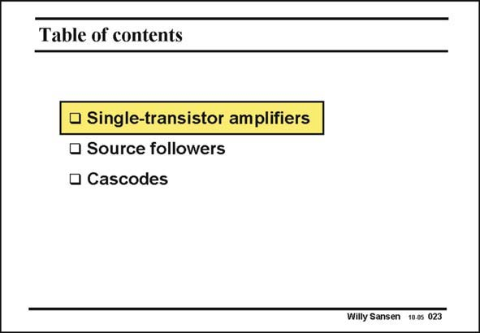

# SANSEN-023 · Table of contents

章节：02 放大器、源极跟随器与共源共栅级  
PDF 页：51；书本页：52；幻灯片编号：023  
状态：unreviewed



## 第二章公式推导

目录与基本电路分类；导入单管放大器，无独立待推导公式。

[完整 Markdown 解释](../../derivations/ch02/00-conventions.md) · [排版公式网页](../../derivations/ch02/00-conventions.html)

状态：context_reviewed_no_independent_derivation；SFG：not_applicable。本页为章节脉络，无独立小信号模型需建图。

模型、近似与来源差异以新推导页为准；下方保留第一步的原始抽取。

## 对应教材讲解

### PDF 50 · 书本 51

After all, only a few elementary circuit blocks can be identified. One single transistor can be used as an amplifier, a source follower or a cascode. Moreover, gain boosting can be applied to a cascode, which is little more than a cascode combined with an amplifier. Obviously a MOST can also be used as a switch.

### PDF 51 · 书本 52

With two transistors two more configurations can be identified. They are the differential pair and the current mirror. Combined, they give rise to a full four-transistor differential voltage and current amplifier. One version of this differential current amplifier has as many as four inputs, which makes it a very versatile building block indeed. We start with an amplifier, using only one single transistor.

## 公式／性能结论候选摘录

以下为规则截取的原文，尚未逐项判读。

- PDF 50: Moreover, gain boosting can be applied to a cascode, which is little more than a cascode combined with an amplifier.

## 曲线结论候选摘录

以下为规则截取的原文，尚未逐项判读。

（未由规则找到；不代表原页没有此类内容。）

## 原文条件与近似候选摘录

以下为规则截取的原文，尚未逐项判读。

（未由规则找到；不代表原页没有此类内容。）

## 幻灯片 OCR（未校正）

```text
Table of contents
• Single-transistor amplifiers
• Source followers
• Cascodes
Willy Sansen 10.0s 023
```

数学上下标、分数及正负号以原图为准。电路图已保留；未核对的连接不输出成可仿真 netlist。
