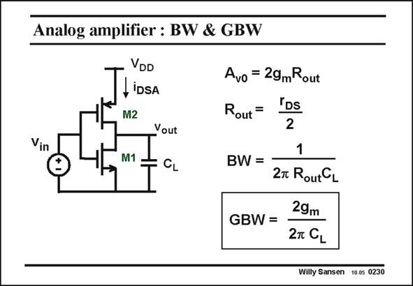

# SANSEN-0230 · Analog amplifier : BW & GBW

章节：02 放大器、源极跟随器与共源共栅级  
PDF 页：64；书本页：65；幻灯片编号：0230  
状态：unreviewed



## Spectre 仿真

本推导组的代表模型已完成 Spectre 验证；覆盖范围以所列网表为准，未逐一搭建所有幻灯片电路。

[本组波形与仿真报告](../../simulations/ch02/index.html#07-inverter-ac)

## 第二章公式推导

以二节点矩阵保留输入、输出与跨接电容，核对单管／总跨导的系数。

[完整 Markdown 解释](../../derivations/ch02/07-inverter-ac.md) · [排版公式网页](../../derivations/ch02/07-inverter-ac.html)

状态：derived_in_stated_model；SFG：not_needed。此组以微分、KCL 或矩阵即可说明机制，没有必要另画 SFG。

模型、近似与来源差异以新推导页为准；下方保留第一步的原始抽取。

## 对应教材讲解

### PDF 64 · 书本 65

We can also leave the output resistance in the expression of the gain. This makes it a bit easier to see how this same output resistance determines the output pole or the bandwidth. Moreover, this output resistance drops out in the calculation of the GBW. This was also the case for a single-transistor amplifier. However the GBW is now twice as high as we have double the transconductance of one single transistor. This circuit is therefore a simple case of current reuse. The GBW is again the most important specification. It indicates how much voltage gain can be expected at any frequency. It depends on the current, though transconductance g . m

## 公式／性能结论候选摘录

以下为规则截取的原文，尚未逐项判读。

- PDF 64: We can also leave the output resistance in the expression of the gain.
- PDF 64: This makes it a bit easier to see how this same output resistance determines the output pole or the bandwidth.
- PDF 64: This circuit is therefore a simple case of current reuse.
- PDF 64: It indicates how much voltage gain can be expected at any frequency.
- PDF 64: It depends on the current, though transconductance g . m

## 曲线结论候选摘录

以下为规则截取的原文，尚未逐项判读。

（未由规则找到；不代表原页没有此类内容。）

## 原文条件与近似候选摘录

以下为规则截取的原文，尚未逐项判读。

（未由规则找到；不代表原页没有此类内容。）

## 幻灯片 OCR（未校正）

```text
Analog amplifier : BW & GBW
Vin
TLiosA
M2
Yout
M1
Avo = 29mRout
Rout =
"Ds
2
1
BW =
27 RoutC1
29m
GBW =
2T CL
Willy Sansen 10.05 0230
```

数学上下标、分数及正负号以原图为准。电路图已保留；未核对的连接不输出成可仿真 netlist。
