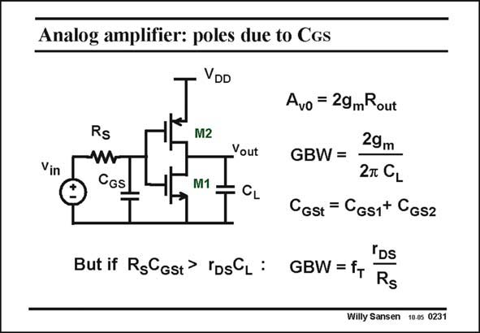

# SANSEN-0231 · Analog amplifier: poles due to CGs

章节：02 放大器、源极跟随器与共源共栅级  
PDF 页：65；书本页：66；幻灯片编号：0231  
状态：unreviewed



## Spectre 仿真

本推导组的代表模型已完成 Spectre 验证；覆盖范围以所列网表为准，未逐一搭建所有幻灯片电路。

[本组波形与仿真报告](../../simulations/ch02/index.html#07-inverter-ac)

## 第二章公式推导

以二节点矩阵保留输入、输出与跨接电容，核对单管／总跨导的系数。

[完整 Markdown 解释](../../derivations/ch02/07-inverter-ac.md) · [排版公式网页](../../derivations/ch02/07-inverter-ac.html)

状态：derived_with_source_notes；SFG：not_needed。此组以微分、KCL 或矩阵即可说明机制，没有必要另画 SFG。

模型、近似与来源差异以新推导页为准；下方保留第一步的原始抽取。

## 对应教材讲解

### PDF 65 · 书本 66

The BW and GBW are easily determined since there is only one large capacitor at the output. If this load capacitor is smaller, then the transistor capacitances start to apply. For example, if the source resistor R is large, then S clearly the input capacitance 2C will cause an addi- GS tional time constant 2R C , which will generate S GS another pole. This is called the non-dominant pole. This latter non-dominant pole can even become dominant if R is very large, or more importantly, if the R C product S S GSt is larger than r C . This is easily calculated from the small-signal equivalent circuit. DS L In this case, the GBW is determined by the R C product. As was already the case for a S GS single-transistor amplifier, the GBW now depends on the f and a resistor ratio. T

## 公式／性能结论候选摘录

以下为规则截取的原文，尚未逐项判读。

- PDF 65: As was already the case for a S GS single-transistor amplifier, the GBW now depends on the f and a resistor ratio.

## 曲线结论候选摘录

以下为规则截取的原文，尚未逐项判读。

（未由规则找到；不代表原页没有此类内容。）

## 原文条件与近似候选摘录

以下为规则截取的原文，尚未逐项判读。

（未由规则找到；不代表原页没有此类内容。）

## 幻灯片 OCR（未校正）

```text
Analog amplifier: poles due to CGs
Vin
Rs
CGS
VDD
M2
Yout
M1 =
Avo = 29mRout
GBW =
29m
2T CL
Cgst = Cgs1+ Cgsz
TDS
But if RgCgst> rpsCl: GBW=f+
Rs
Willy Sansen 10.05 0231
```

数学上下标、分数及正负号以原图为准。电路图已保留；未核对的连接不输出成可仿真 netlist。
