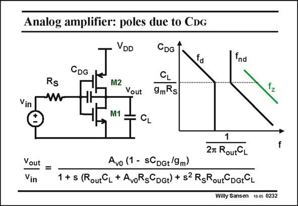

# SANSEN-0232 · Analog amplifier: poles due to CDG

章节：02 放大器、源极跟随器与共源共栅级  
PDF 页：65；书本页：66；幻灯片编号：0232  
状态：unreviewed



## Spectre 仿真

本推导组的代表模型已完成 Spectre 验证；覆盖范围以所列网表为准，未逐一搭建所有幻灯片电路。

[本组波形与仿真报告](../../simulations/ch02/index.html#07-inverter-ac)

## 第二章公式推导

以二节点矩阵保留输入、输出与跨接电容，核对单管／总跨导的系数。

[完整 Markdown 解释](../../derivations/ch02/07-inverter-ac.md) · [排版公式网页](../../derivations/ch02/07-inverter-ac.html)

状态：derived_with_source_notes；SFG：not_needed。此组以微分、KCL 或矩阵即可说明机制，没有必要另画 SFG。

模型、近似与来源差异以新推导页为准；下方保留第一步的原始抽取。

## 对应教材讲解

### PDF 65 · 书本 66

It is also possible that the Miller effect is present. For example if R is large, and S the gain is large, then 2C A may be larger than DGt v 2C . The non-dominant GS pole is then determined by the time constant 2R C A . S DGt v This latter non-dominant pole can even become dominant if R or C is very S DGt large. In order to see this, we have to derive the full expression of the gain, from the small-signal equivalent circuit. It is given in this slide. It has two poles and one zero. The dominant pole is at the output, at least whilst C is small. The best way to show this, DGt is to verify a pole-zero position diagram with C as a variable. This is nothing more than DGt bilogarithmic diagram of the poles and zeros versus parameter C . It is asymptotic to show DGt clearly the positions of all break points. More details on such diagram are given in slide N0536 of Chapter 5. The dominant pole frequency f is clearly determined by the output time constant. For higher d values of C than C /(g R ), the Miller effect dominates. DGt L m S

### PDF 66 · 书本 67

The non-dominant pole f is at higher frequencies. nd The positive zero f is at very high frequencies. z

## 公式／性能结论候选摘录

以下为规则截取的原文，尚未逐项判读。

- PDF 65: For example if R is large, and S the gain is large, then 2C A may be larger than DGt v 2C .
- PDF 65: In order to see this, we have to derive the full expression of the gain, from the small-signal equivalent circuit.

## 曲线结论候选摘录

以下为规则截取的原文，尚未逐项判读。

（未由规则找到；不代表原页没有此类内容。）

## 原文条件与近似候选摘录

以下为规则截取的原文，尚未逐项判读。

（未由规则找到；不代表原页没有此类内容。）

## 幻灯片 OCR（未校正）

```text
Analog amplifier: poles due to CDG
Rs
CDG
VDD
CDG
Vout
CL
9mRs
fnd
Vin
M2
M1
CL
Vout
Vin
=
1
27 RoutCL
Avo (1 - sCDGt 9m)
1 +s (RoutGL + AvoRsGDGt) + s2 RgRoutCDGtGL
Willy Sansen 10.05 0232
f
```

数学上下标、分数及正负号以原图为准。电路图已保留；未核对的连接不输出成可仿真 netlist。
