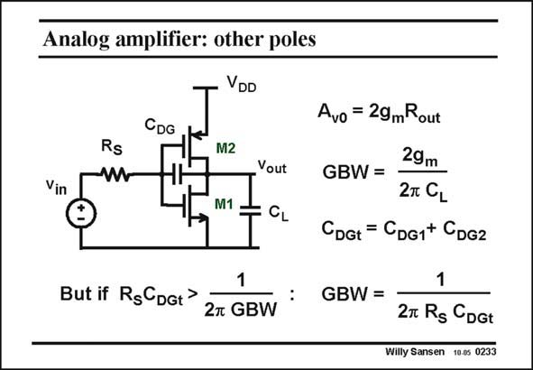

# SANSEN-0233 · Analog amplifier: other poles

章节：02 放大器、源极跟随器与共源共栅级  
PDF 页：66；书本页：67；幻灯片编号：0233  
状态：unreviewed



## Spectre 仿真

本推导组的代表模型已完成 Spectre 验证；覆盖范围以所列网表为准，未逐一搭建所有幻灯片电路。

[本组波形与仿真报告](../../simulations/ch02/index.html#07-inverter-ac)

## 第二章公式推导

以二节点矩阵保留输入、输出与跨接电容，核对单管／总跨导的系数。

[完整 Markdown 解释](../../derivations/ch02/07-inverter-ac.md) · [排版公式网页](../../derivations/ch02/07-inverter-ac.html)

状态：derived_in_stated_model；SFG：not_needed。此组以微分、KCL 或矩阵即可说明机制，没有必要另画 SFG。

模型、近似与来源差异以新推导页为准；下方保留第一步的原始抽取。

## 对应教材讲解

### PDF 66 · 书本 67

The Miller effect is dominant if R is very large, or S more importantly, if the R C product is larger S DGt than 1(2pGBW). This is also easily calculated from the small-signal equivalent circuit, or from the expression of the gain. In this case, the GBW is determined by the R C S DGt product, as was already the case for a single-transistor amplifier with only a Miller capacitance. Indeed, only the feedback elements will then determine the GBW, not the transistor parameters.

## 公式／性能结论候选摘录

以下为规则截取的原文，尚未逐项判读。

- PDF 66: This is also easily calculated from the small-signal equivalent circuit, or from the expression of the gain.

## 曲线结论候选摘录

以下为规则截取的原文，尚未逐项判读。

（未由规则找到；不代表原页没有此类内容。）

## 原文条件与近似候选摘录

以下为规则截取的原文，尚未逐项判读。

（未由规则找到；不代表原页没有此类内容。）

## 幻灯片 OCR（未校正）

```text
Analog amplifier: other poles
VDD
Vin
Rs
CDG
M2
Yout
M1 =
- CL
Avo = 29mRout
GBW =
29m
2T CL
CDGt = CDG1+ CDG2
But if RgCDGt>
27 GBW : GBW=
1
27 Rg CDGt
Willy Sansen 10.0s 0233
```

数学上下标、分数及正负号以原图为准。电路图已保留；未核对的连接不输出成可仿真 netlist。
