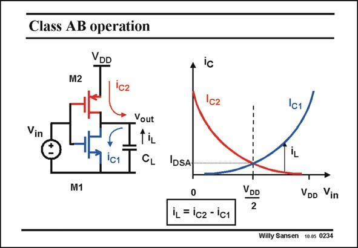

# SANSEN-0234 · Class AB operation

章节：02 放大器、源极跟随器与共源共栅级  
PDF 页：66；书本页：67；幻灯片编号：0234  
状态：unreviewed



## Spectre 仿真

本推导组的代表模型已完成 Spectre 验证；覆盖范围以所列网表为准，未逐一搭建所有幻灯片电路。

[本组波形与仿真报告](../../simulations/ch02/index.html#06-inverter-dc)

## 第二章公式推导

分开 NMOS／PMOS 的电流，求总跨导与有限输出导纳下的增益。

[完整 Markdown 解释](../../derivations/ch02/06-inverter-dc.md) · [排版公式网页](../../derivations/ch02/06-inverter-dc.html)

状态：derived_in_stated_model；SFG：not_needed。此组以微分、KCL 或矩阵即可说明机制，没有必要另画 SFG。

模型、近似与来源差异以新推导页为准；下方保留第一步的原始抽取。

## 对应教材讲解

### PDF 66 · 书本 67

This same small-signal amplifier also behaves as a class-AB amplifier for large input signals. This is especially needed to drive larger load capacitances. Switching the input voltage from low to high, will cause the nMOST current i to be much larger than C1 the quiescent current I . DSA At this point the pMOST current i has become very C2 small. The current i in the L load capacitance will now be nearly equal to the nMOST current i and will be large, discharging that load capacitance quite fast. C1 This is only one of the simplest class-AB amplifiers however, with lot of disadvantages. One of the most notable disadvantages is that the currents strongly depend on the supply voltage. Better ones are discussed in Chapter 12.

## 公式／性能结论候选摘录

以下为规则截取的原文，尚未逐项判读。

- PDF 66: The current i in the L load capacitance will now be nearly equal to the nMOST current i and will be large, discharging that load capacitance quite fast.
- PDF 66: One of the most notable disadvantages is that the currents strongly depend on the supply voltage.

## 曲线结论候选摘录

以下为规则截取的原文，尚未逐项判读。

（未由规则找到；不代表原页没有此类内容。）

## 原文条件与近似候选摘录

以下为规则截取的原文，尚未逐项判读。

- PDF 66: Switching the input voltage from low to high, will cause the nMOST current i to be much larger than C1 the quiescent current I .

## 幻灯片 OCR（未校正）

```text
Class AB operation
VDD
M2
C2
Vin
іс1
Vout
tiL
CL
M1
Ic
Ic2
iL
IDSA
0
iL = ic2 - ic1
VDD
2
VDD Vin
Willy Sansen 10.05 0234
```

数学上下标、分数及正负号以原图为准。电路图已保留；未核对的连接不输出成可仿真 netlist。
