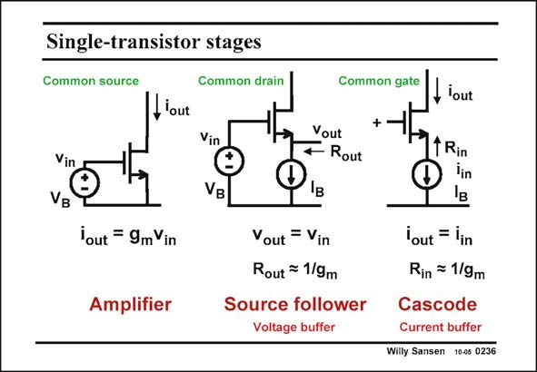

# SANSEN-0236 · Single-transistor stages

章节：02 放大器、源极跟随器与共源共栅级  
PDF 页：67；书本页：68；幻灯片编号：0236  
状态：unreviewed



## Spectre 仿真

本推导组的代表模型已完成 Spectre 验证；覆盖范围以所列网表为准，未逐一搭建所有幻灯片电路。

[本组波形与仿真报告](../../simulations/ch02/index.html#08-followers-dc)

## 第二章公式推导

由输出节点 KCL 求跟随增益、输出阻抗与衬底固定时的体效应。

[完整 Markdown 解释](../../derivations/ch02/08-followers-dc.md) · [排版公式网页](../../derivations/ch02/08-followers-dc.html)

状态：derived_in_stated_model；SFG：not_needed。此组以微分、KCL 或矩阵即可说明机制，没有必要另画 SFG。

模型、近似与来源差异以新推导页为准；下方保留第一步的原始抽取。

## 对应教材讲解

### PDF 67 · 书本 68

A good overview of all the single-transistor stages is given in this slide. The first one, the amplifier, is also called commonsource stage. It converts an input voltage into an output current, by means of transconductance g . The biasm ing is done by means of a voltage source V at the B input, which is the V . GS The other two stages are called respectively a Source follower and Cascode. They have the same biasing setup. Both are biased by a DC current source I . Their V then adjusts itself such that the current B GS can flow effectively. In a Source follower the small-signal input voltage is applied at the Gate. The output is at the Source. Since the current is kept constant by the current source, the V is also constant. As GS a result any small-signal variation at the input will give rise to an equal small-signal at the output. The voltage gain is therefore unity. This is why a Source follower is also called a Voltage buffer. It is a buffer because its input resistance is infinity but its output resistance is only 1/g . This m stage will now be used to transfer a voltage in an accurate way from a high impedance to a lower one. This is required for microphone amplifiers, biopotential preamplifiers, etc. Their internal impedances can be many hundreds of MV’s!

## 公式／性能结论候选摘录

以下为规则截取的原文，尚未逐项判读。

- PDF 67: As GS a result any small-signal variation at the input will give rise to an equal small-signal at the output.
- PDF 67: The voltage gain is therefore unity.

## 曲线结论候选摘录

以下为规则截取的原文，尚未逐项判读。

（未由规则找到；不代表原页没有此类内容。）

## 原文条件与近似候选摘录

以下为规则截取的原文，尚未逐项判读。

（未由规则找到；不代表原页没有此类内容。）

## 幻灯片 OCR（未校正）

```text
Single-transistor stages
Common source
Common drain
Common gate
lout
Vin
VB
Vin
®
VB
Vout
Rout
, lout
1 Rin
'out = 9mVin
Amplifier
Vout = Vin
Rout = 1/9m
Source follower
Voltage buffer
lout = lin
Rin = 1/9m
Cascode
Current buffer
Willy Sansen 10-05 0236
```

数学上下标、分数及正负号以原图为准。电路图已保留；未核对的连接不输出成可仿真 netlist。
