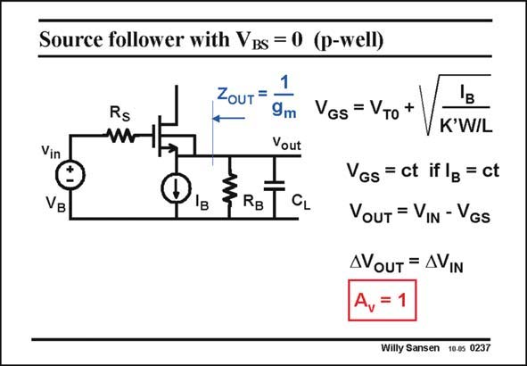

# SANSEN-0237 · Source follower with VBs = 0 (p-well)

章节：02 放大器、源极跟随器与共源共栅级  
PDF 页：68；书本页：69；幻灯片编号：0237  
状态：unreviewed



## Spectre 仿真

本推导组的代表模型已完成 Spectre 验证；覆盖范围以所列网表为准，未逐一搭建所有幻灯片电路。

[本组波形与仿真报告](../../simulations/ch02/index.html#08-followers-dc)

## 第二章公式推导

由输出节点 KCL 求跟随增益、输出阻抗与衬底固定时的体效应。

[完整 Markdown 解释](../../derivations/ch02/08-followers-dc.md) · [排版公式网页](../../derivations/ch02/08-followers-dc.html)

状态：derived_in_stated_model；SFG：not_needed。此组以微分、KCL 或矩阵即可说明机制，没有必要另画 SFG。

模型、近似与来源差异以新推导页为准；下方保留第一步的原始抽取。

## 对应教材讲解

### PDF 68 · 书本 69

An nMOST source follower is sketched in this slide. Note that firstly we connect the Bulk contact to the Source. This is only possible in a p-well CMOS technology. In a n-well CMOS technology, which is a lot more prevalent, we would have to take a pMOS source follower. Otherwise we cannot connect the Bulk to the Source. For a DC current source I , the resultant V is easily B GS found from the current expression. The DC output voltage will now be the DC gate voltage V minus this V value. We can try to optimize this B GS value of V for the largest possible output swing. Quite often, a Source follower has to handle B only small signals. When used in the output stage of a power amplifier however, the optimization of the output swing is a definite requirement, as will be explained in Chapter 12 on class AB amplifiers. It is clear that as long as V is constant, the output follows the input for small signals. The GS gain is therefore unity. Moreover, substitution of the MOST by its small-signal model, readily shows that the output resistance is 1/g . We can usually neglect r with respect to 1/g , obviously depending on the m DS m values of V −V and channel length L. GS T

## 公式／性能结论候选摘录

以下为规则截取的原文，尚未逐项判读。

- PDF 68: The GS gain is therefore unity.
- PDF 68: We can usually neglect r with respect to 1/g , obviously depending on the m DS m values of V −V and channel length L.

## 曲线结论候选摘录

以下为规则截取的原文，尚未逐项判读。

（未由规则找到；不代表原页没有此类内容。）

## 原文条件与近似候选摘录

以下为规则截取的原文，尚未逐项判读。

- PDF 68: We can usually neglect r with respect to 1/g , obviously depending on the m DS m values of V −V and channel length L.

## 幻灯片 OCR（未校正）

```text
Source follower with VBs = 0 (p-well)
Vin
VB
Rs
W
1
ZouT=
9m
Vout
S
RB
CL
'в
VGs = VTo +
K'W/L
VGs = ct if lg = ct
OUT = VIN - VGs
AVOUT = AVIN
Willy Sansen 10.05 0237
```

数学上下标、分数及正负号以原图为准。电路图已保留；未核对的连接不输出成可仿真 netlist。
