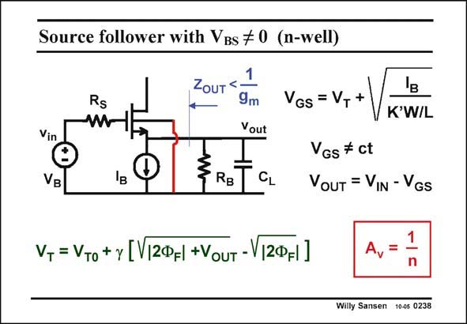

# SANSEN-0238 · Source follower with VBs # 0 (n-well)

章节：02 放大器、源极跟随器与共源共栅级  
PDF 页：68；书本页：69；幻灯片编号：0238  
状态：unreviewed



## Spectre 仿真

本推导组的代表模型已完成 Spectre 验证；覆盖范围以所列网表为准，未逐一搭建所有幻灯片电路。

[本组波形与仿真报告](../../simulations/ch02/index.html#08-followers-dc)

## 第二章公式推导

由输出节点 KCL 求跟随增益、输出阻抗与衬底固定时的体效应。

[完整 Markdown 解释](../../derivations/ch02/08-followers-dc.md) · [排版公式网页](../../derivations/ch02/08-followers-dc.html)

状态：derived_in_stated_model；SFG：not_needed。此组以微分、KCL 或矩阵即可说明机制，没有必要另画 SFG。

模型、近似与来源差异以新推导页为准；下方保留第一步的原始抽取。

## 对应教材讲解

### PDF 68 · 书本 69

In a nMOST source follower in a n-well CMOS technology, the Bulk can never be connected to the Source. As a result, the MOST has a V voltage, BS which is actually the output voltage V . Consequent- OUT ly, the V is no longer con- GS stant. It receives a smallsignal contribution, which is not zero. If we now use the expression of the V as a function T of V (shown in this slide), BS we obtain a nonlinear expression of V versus V . Parameter c shows up, which represents the body effect or the OUT IN parasitic JFET.

### PDF 69 · 书本 70

Taking the derivative of V versus V yields the small-signal gain. Surprisingly this gain is OUT IN very simple, just 1/n. Since n is a rather unpredictable value, so is the gain. It is certainly smaller than unity, somewhere between 0.6 and 0.8. The output impedance is then somewhat smaller as it is now the parallel combination of 1/g m and 1/g . This shows clearly that at the output we see the MOST and the parasitic JFET mB in parallel.

## 公式／性能结论候选摘录

以下为规则截取的原文，尚未逐项判读。

- PDF 68: As a result, the MOST has a V voltage, BS which is actually the output voltage V .
- PDF 69: Taking the derivative of V versus V yields the small-signal gain.
- PDF 69: Surprisingly this gain is OUT IN very simple, just 1/n.
- PDF 69: Since n is a rather unpredictable value, so is the gain.

## 曲线结论候选摘录

以下为规则截取的原文，尚未逐项判读。

（未由规则找到；不代表原页没有此类内容。）

## 原文条件与近似候选摘录

以下为规则截取的原文，尚未逐项判读。

（未由规则找到；不代表原页没有此类内容。）

## 幻灯片 OCR（未校正）

```text
Source follower with VBs # 0 (n-well)
ZouT<
Rs
Vin
VB
RB
9m
Yout
CL
VGs = V++
'в
K'W/L
VGs # ct
OUT = VIN - VGS
V,= VTo + y [V|2@=| +VouT-V|2@F|]
A,
Willy Sansen 10-05 0238
```

数学上下标、分数及正负号以原图为准。电路图已保留；未核对的连接不输出成可仿真 netlist。
