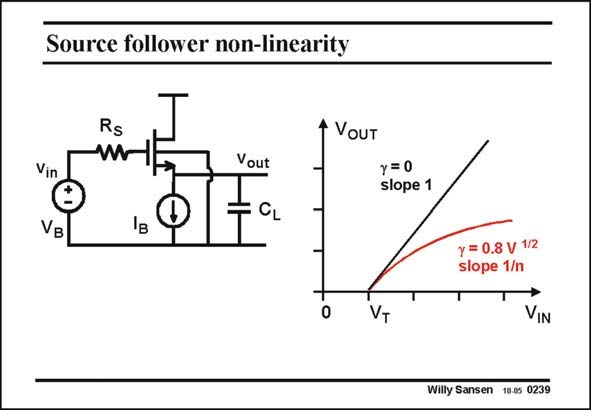

# SANSEN-0239 · Source follower non-linearity

章节：02 放大器、源极跟随器与共源共栅级  
PDF 页：69；书本页：70；幻灯片编号：0239  
状态：unreviewed



## Spectre 仿真

本推导组的代表模型已完成 Spectre 验证；覆盖范围以所列网表为准，未逐一搭建所有幻灯片电路。

[本组波形与仿真报告](../../simulations/ch02/index.html#08-followers-dc)

## 第二章公式推导

由输出节点 KCL 求跟随增益、输出阻抗与衬底固定时的体效应。

[完整 Markdown 解释](../../derivations/ch02/08-followers-dc.md) · [排版公式网页](../../derivations/ch02/08-followers-dc.html)

状态：derived_in_stated_model；SFG：not_needed。此组以微分、KCL 或矩阵即可说明机制，没有必要另画 SFG。

模型、近似与来源差异以新推导页为准；下方保留第一步的原始抽取。

## 对应教材讲解

### PDF 69 · 书本 70

The nonlinearity of the expression of V versus OUT V is clearly visible in the IN transfer characteristic. If the Bulk can be connected to the Source (c=0) then the slope of the characteristic is unity: the Source follower has a unity gain. If however, the Bulk is connected to ground (c>0) then clearly the curve is very nonlinear. A lot of distortion is then generated. In addition, it is not clear what the gain is, as the slope depends on the DC biasing voltages. It is preferable that this stage is never used. In a n-well CMOS process, only pMOST source followers can be used, provided their Bulk is connected to the Source.

## 公式／性能结论候选摘录

以下为规则截取的原文，尚未逐项判读。

- PDF 69: If the Bulk can be connected to the Source (c=0) then the slope of the characteristic is unity: the Source follower has a unity gain.
- PDF 69: In addition, it is not clear what the gain is, as the slope depends on the DC biasing voltages.

## 曲线结论候选摘录

以下为规则截取的原文，尚未逐项判读。

- PDF 69: The nonlinearity of the expression of V versus OUT V is clearly visible in the IN transfer characteristic.
- PDF 69: If the Bulk can be connected to the Source (c=0) then the slope of the characteristic is unity: the Source follower has a unity gain.
- PDF 69: If however, the Bulk is connected to ground (c>0) then clearly the curve is very nonlinear.
- PDF 69: In addition, it is not clear what the gain is, as the slope depends on the DC biasing voltages.

## 原文条件与近似候选摘录

以下为规则截取的原文，尚未逐项判读。

- PDF 69: In a n-well CMOS process, only pMOST source followers can be used, provided their Bulk is connected to the Source.

## 幻灯片 OCR（未校正）

```text
Source follower non-linearity
Rs
+ VoUT
Vout
Vin
VB
y=0
slope 1
y = 0.8 v 1/2
slope 1/n
T
0
VT
VIN
Willy Sansen 10.0s 0239
```

数学上下标、分数及正负号以原图为准。电路图已保留；未核对的连接不输出成可仿真 netlist。
