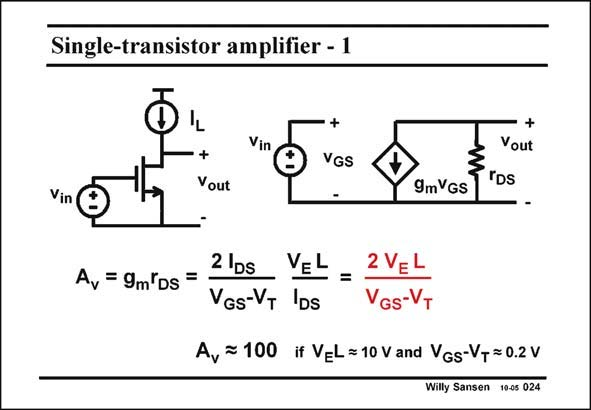

# SANSEN-024 · Single-transistor amplifier - 1

章节：02 放大器、源极跟随器与共源共栅级  
PDF 页：51；书本页：52；幻灯片编号：024  
状态：unreviewed



## Spectre 仿真

本推导组的代表模型已完成 Spectre 验证；覆盖范围以所列网表为准，未逐一搭建所有幻灯片电路。

[本组波形与仿真报告](../../simulations/ch02/index.html#01-intrinsic-gain)

## 第二章公式推导

由漏极 KCL 与器件电流微分得到增益，再比较固定过驱动电压下的 MOS／BJT。

[完整 Markdown 解释](../../derivations/ch02/01-intrinsic-gain.md) · [排版公式网页](../../derivations/ch02/01-intrinsic-gain.html)

状态：derived_in_stated_model；SFG：not_needed。此组以微分、KCL 或矩阵即可说明机制，没有必要另画 SFG。

模型、近似与来源差异以新推导页为准；下方保留第一步的原始抽取。

## 对应教材讲解

### PDF 51 · 书本 52

A single-transistor amplifier is biased by a voltage source V , on which a small-signal IN input voltage v is superimin posed. Biasing will be discussed later. However, it is important to note that an amplifier is normally loaded by a DC current source. In this way the maximum gain can be obtained. Indeed, an ideal current source has an infinite output resistance. It is therefore not visible in the small-signal equivalent circuit, shown on the right. The voltage gain A is easily found by this equivalent circuit. It is g r . Both parameters v m DS depend on the current, however. As a result, the gain A becomes independent of the current. It v depends not only on a technological parameter V but also on two parameters, which can be E chosen by the designer. They are V −V and channel length L. GS T It is obvious that for large gain A , we must choose V −V as small as possible and L as v GS T large as possible.

## 公式／性能结论候选摘录

以下为规则截取的原文，尚未逐项判读。

- PDF 51: In this way the maximum gain can be obtained.
- PDF 51: It is therefore not visible in the small-signal equivalent circuit, shown on the right.
- PDF 51: The voltage gain A is easily found by this equivalent circuit.
- PDF 51: Both parameters v m DS depend on the current, however.
- PDF 51: As a result, the gain A becomes independent of the current.
- PDF 51: It v depends not only on a technological parameter V but also on two parameters, which can be E chosen by the designer.
- PDF 51: GS T It is obvious that for large gain A , we must choose V −V as small as possible and L as v GS T large as possible.

## 曲线结论候选摘录

以下为规则截取的原文，尚未逐项判读。

（未由规则找到；不代表原页没有此类内容。）

## 原文条件与近似候选摘录

以下为规则截取的原文，尚未逐项判读。

（未由规则找到；不代表原页没有此类内容。）

## 幻灯片 OCR（未校正）

```text
Single-transistor amplifier - 1
Vin
+
Vout
+
VGS
+
+
Yout
IDs
Vin
9mVGS
Av = 9m'Ds =
2 IDs
VEL
VGs-VT IDs
=
2 VEL
VGs-VT
Ay = 100 if VEL=10 V and VGs-VT= 0.2 V
Willy Sansen 10-0s 024
```

数学上下标、分数及正负号以原图为准。电路图已保留；未核对的连接不输出成可仿真 netlist。
