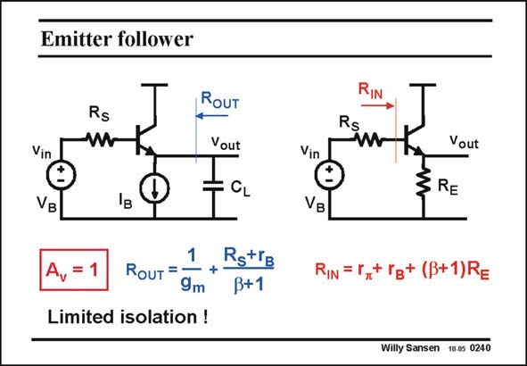

# SANSEN-0240 · Emitter follower

章节：02 放大器、源极跟随器与共源共栅级  
PDF 页：69；书本页：70；幻灯片编号：0240  
状态：unreviewed



## Spectre 仿真

本推导组的代表模型已完成 Spectre 验证；覆盖范围以所列网表为准，未逐一搭建所有幻灯片电路。

[本组波形与仿真报告](../../simulations/ch02/index.html#08-followers-dc)

## 第二章公式推导

由输出节点 KCL 求跟随增益、输出阻抗与衬底固定时的体效应。

[完整 Markdown 解释](../../derivations/ch02/08-followers-dc.md) · [排版公式网页](../../derivations/ch02/08-followers-dc.html)

状态：derived_in_stated_model；SFG：not_needed。此组以微分、KCL 或矩阵即可说明机制，没有必要另画 SFG。

模型、近似与来源差异以新推导页为准；下方保留第一步的原始抽取。

## 对应教材讲解

### PDF 69 · 书本 70

A Source follower is an ideal buffer in the sense that it translates an input voltage unattenuated (if the Bulk is connected to the Source) from an infinite impedance at the input to a mere 1/g m to the output. This is not true for its bipolar equivalent, an emitter follower. A bipolar transistor has Base current. As a result it has a finite input resistance (r ). This causes an addip tional term in the expression of the output resistance. This term is the sum of all the resistances, seen at the input, divided by

### PDF 70 · 书本 71

b+1 or simply b. A bipolar transistor only provides a limited amount of isolation between input and output, which is about b. The higher the beta the better the isolation. A MOST, which has a beta of infinity also provides infinite isolation. The same is true for the input resistance. It can never be infinite, as for a MOST source follower. It will be the resistance seen at the emitter, multiplied by the beta. This may be insufficient for some preamplifiers (microphone, etc). This is why, quite often, a few emitter followers are cascaded.

## 公式／性能结论候选摘录

以下为规则截取的原文，尚未逐项判读。

- PDF 69: As a result it has a finite input resistance (r ).
- PDF 70: A bipolar transistor only provides a limited amount of isolation between input and output, which is about b.

## 曲线结论候选摘录

以下为规则截取的原文，尚未逐项判读。

（未由规则找到；不代表原页没有此类内容。）

## 原文条件与近似候选摘录

以下为规则截取的原文，尚未逐项判读。

（未由规则找到；不代表原页没有此类内容。）

## 幻灯片 OCR（未校正）

```text
Emitter follower
ROUT
Vout
CL
VB
1
RstrB
RouT =
+
9m
ß+1
Limited isolation !
Rs
Vout
Vin
VB
RE
RIN = 1,
+ rg+ (B+1)RE
Willy Sansen 10.05 0240
```

数学上下标、分数及正负号以原图为准。电路图已保留；未核对的连接不输出成可仿真 netlist。
