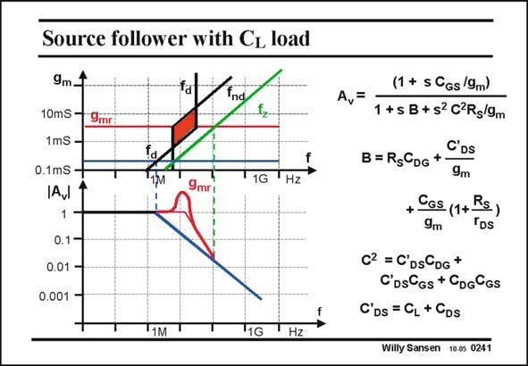

# SANSEN-0241 · Source follower with CL load

章节：02 放大器、源极跟随器与共源共栅级  
PDF 页：70；书本页：71；幻灯片编号：0241  
状态：unreviewed



## Spectre 仿真

本推导组的代表模型已完成 Spectre 验证；覆盖范围以所列网表为准，未逐一搭建所有幻灯片电路。

[本组波形与仿真报告](../../simulations/ch02/index.html#09-followers-hf)

## 第二章公式推导

直接求二次分母与判别式，并将零点代入分母确认相消条件。

[完整 Markdown 解释](../../derivations/ch02/09-followers-hf.md) · [排版公式网页](../../derivations/ch02/09-followers-hf.html)

状态：derived_in_stated_model；SFG：used。电压／电流混合节点；分别保留栅源压差、跨导、各电容电流及输出测试电流。

模型、近似与来源差异以新推导页为准；下方保留第一步的原始抽取。

## 对应教材讲解

### PDF 70 · 书本 71

At higher frequencies, a source follower looses its buffer capabilities. Moreover, it can show peaking. Indeed, including all three transistor capacitances in the small-signal model, yields an expression for the gain which is quite complicated. The best way to explore this, is to draw a pole-zero position diagram, with one particular parameter as a variable. Here the transconductance is chosen, as it depends directly on the current. The current stands for the power consumption. Two poles can be extracted from the roots of the denominator. One zero is also present. In the middle, a hatched region emerges, where the lines of f and f cross. In this region the d nd poles are complex. They cause peaking in the Bode diagram. It is clear that there is an optimum current for such a Source-follower that is actually quite small. For very low currents, the f (or bandwidth) is too small, and increases with the current. d For higher currents, complex poles develop and for even higher currents the bandwidth ceases to increase. The optimum is thus at the bottom point of the complex pole region. Let us find the corresponding current.

## 公式／性能结论候选摘录

以下为规则截取的原文，尚未逐项判读。

- PDF 70: Indeed, including all three transistor capacitances in the small-signal model, yields an expression for the gain which is quite complicated.
- PDF 70: Here the transconductance is chosen, as it depends directly on the current.
- PDF 70: For very low currents, the f (or bandwidth) is too small, and increases with the current. d For higher currents, complex poles develop and for even higher currents the bandwidth ceases to increase.
- PDF 70: The optimum is thus at the bottom point of the complex pole region.

## 曲线结论候选摘录

以下为规则截取的原文，尚未逐项判读。

- PDF 70: Moreover, it can show peaking.
- PDF 70: They cause peaking in the Bode diagram.

## 原文条件与近似候选摘录

以下为规则截取的原文，尚未逐项判读。

（未由规则找到；不代表原页没有此类内容。）

## 幻灯片 OCR（未校正）

```text
Source follower with CL load
9m1
10mS -
9mrl
1mS -
0.1mS -
Aul
1
0.1-
0.01 -
0.001 •
fa
fa
9mri
t2-
11G
THz
TIM
11G
Hz
(1 + s CGs/9m)
A,=
1 +s B +s2 C2Rg/9m
C'Ds
B= RsCDG +
9m
+ Cos (1+-
9m
Rs,
"Ds
C2 = C'DsGDG +
C'DsGs + CDGCGs
C'Ds = CL + CDs
Willy Sansen 10.05 0241
```

数学上下标、分数及正负号以原图为准。电路图已保留；未核对的连接不输出成可仿真 netlist。
