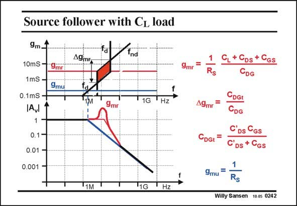
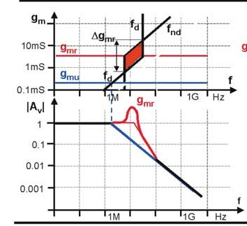

# SANSEN-0242 · 带容性负载的源极跟随器

章节：02 放大器、源极跟随器与共源共栅级  
PDF 页：71；书本页：72；幻灯片编号：0242  
状态：representative_case_visually_reviewed



## Spectre 仿真

本推导组的代表模型已完成 Spectre 验证；覆盖范围以所列网表为准，未逐一搭建所有幻灯片电路。

[本组波形与仿真报告](../../simulations/ch02/index.html#09-followers-hf)

## 第二章公式推导

直接求二次分母与判别式，并将零点代入分母确认相消条件。

[完整 Markdown 解释](../../derivations/ch02/09-followers-hf.md) · [排版公式网页](../../derivations/ch02/09-followers-hf.html)

状态：derived_with_source_notes；SFG：used。电压／电流混合节点；分别保留栅源压差、跨导、各电容电流及输出测试电流。

模型、近似与来源差异以新推导页为准；下方保留第一步的原始抽取。

## 对应教材讲解

### PDF 70 · 书本 71

The value of the transconductance, which goes through the middle of the complex-pole region is denoted by g . It is given in this slide. It depends on the source resistor and the capacitance mr C from gate to ground. Adding capacitance to the gate allows us to reduce the transconductance DG or current where the peak is the worst. The width of that region is given by Dg . It can be made small by increasing mr indeed the capacitance C at the gate. This is called ‘‘compensating the source follower’’. What DG actually happens is that a low-pass filter is added before the source follower, avoiding complex poles to appear.

### PDF 71 · 书本 72

The actual value of g at mr the bottom of the hatched region is then simply g mr divided by the square root of Dg . mr Another point of interest is the crossing point of the nondominant pole with the zero (blue). At this point, we obtain a pure first-order roll-off, albeit with a lower dominant pole. The corresponding transconductance is denoted by g . It only mu depends on the source resistor.

## 已核对的抽取

此页以跨导为参数，标示源极跟随器的复极点区域及增益峰化。正文说明加入栅极对地电容可以改变、缩小容易峰化的区域。

- `g_{mr}=\frac{1}{R_S}\frac{C_L+C_{DS}+C_{GS}}{C_{DG}}` — 原图标出的复极点区域中心跨导。
- `g_{mu}=\frac{1}{R_S}` — 原文指出此处非主导极点与零点相消，得到一阶下降特性。



### 曲线结论

- 红色区域对应复极点及幅度峰化；蓝色条件 g_mu 对应一阶下降特性。
- 原文指出增加栅极对地电容 C_DG 可作为补偿，并改变峰化最严重时的跨导。

### 条件与近似注记

- 符号依本图保留；C_DG、C_DGt 与带撇号电容需连同前页定义使用。
- 此处只转录两个清楚公式，其余公式仍保留原图及 OCR 候选。

### 连接关系

- 本页是前文源极跟随器的响应图，没有重画完整电路；连接关系须回看同节前页。

## 公式／性能结论候选摘录

以下为规则截取的原文，尚未逐项判读。

- PDF 70: It depends on the source resistor and the capacitance mr C from gate to ground.
- PDF 71: It only mu depends on the source resistor.

## 曲线结论候选摘录

以下为规则截取的原文，尚未逐项判读。

- PDF 70: Adding capacitance to the gate allows us to reduce the transconductance DG or current where the peak is the worst.
- PDF 71: At this point, we obtain a pure first-order roll-off, albeit with a lower dominant pole.

## 原文条件与近似候选摘录

以下为规则截取的原文，尚未逐项判读。

（未由规则找到；不代表原页没有此类内容。）

## 幻灯片 OCR（未校正）

```text
Source follower with CL load
A9mF
10mS -
1mS
0.1mS -
Avl
1
0.1-
0.01
0.001
9mr
9mu
1G
9mг
Hz
"1M
'1G
Hz
+ Cps + Cgs
DG
49mr
CDGt
9mu
CDGt
CDG
C'Ds
C'
DS
1
Rs
GS
CGs
Willy Sansen 10.05 0242
```

数学上下标、分数及正负号以原图为准。电路图已保留；未核对的连接不输出成可仿真 netlist。
