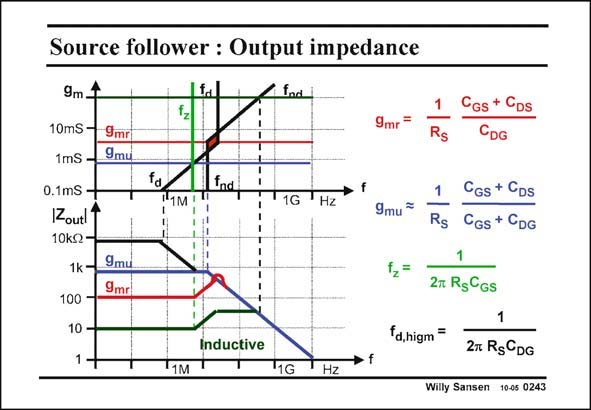
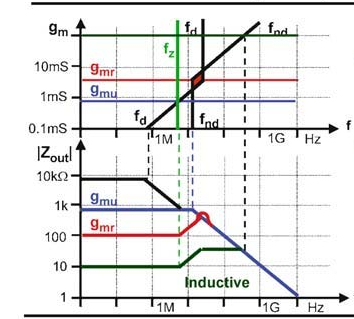

# SANSEN-0243 · 源极跟随器的输出阻抗

章节：02 放大器、源极跟随器与共源共栅级  
PDF 页：71；书本页：72；幻灯片编号：0243  
状态：representative_case_visually_reviewed



## Spectre 仿真

本推导组的代表模型已完成 Spectre 验证；覆盖范围以所列网表为准，未逐一搭建所有幻灯片电路。

[本组波形与仿真报告](../../simulations/ch02/index.html#09-followers-hf)

## 第二章公式推导

直接求二次分母与判别式，并将零点代入分母确认相消条件。

[完整 Markdown 解释](../../derivations/ch02/09-followers-hf.md) · [排版公式网页](../../derivations/ch02/09-followers-hf.html)

状态：derived_with_source_notes；SFG：used。电压／电流混合节点；分别保留栅源压差、跨导、各电容电流及输出测试电流。

模型、近似与来源差异以新推导页为准；下方保留第一步的原始抽取。

## 对应教材讲解

### PDF 71 · 书本 72

The output impedance of a source follower, also shows this region of complex poles. for a particular current. Indeed the pole-zero position diagram of the output impedance, with the transconductance as a parameter, shows that around g , mr complex poles occur, leading to peaking in the Bode diagram. The current corresponding to this g , is mr therefore to be avoided. However, another kind of peaking occurs. In fact, the zero occurs at lower frequencies than both poles. As a result, for large currents, the output impedance first rises, before it decreases. It is inductive! A perfect first-order characteristic can be obtained by tuning the current to realize g . This mu is the transconductance where the zero cancels out the first pole. A wide band source follower at low current results. The output impedance is then resistive up to high frequencies, and equals 1/g . mu This value of g depends mainly on the source resistance. For small resistances, the current mu can be become excessive. In this case, the Source follower can probably be omitted altogether.

## 已核对的抽取

源极跟随器输出阻抗可能因复极点而峰化，也可能在较大电流下先上升而呈感性。适当的 g_mu 可使零点与极点相消。

- `g_{mr}=\frac{1}{R_S}\frac{C_{GS}+C_{DS}}{C_{DG}}` — 本图峰化区域的代表跨导。
- `g_{mu}\approx\frac{1}{R_S}\frac{C_{GS}+C_{DS}}{C_{GS}+C_{DG}}` — 原图明示为近似式。
- `f_z=\frac{1}{2\pi R_S C_{GS}}` — 图中零点频率。
- `f_{d,highm}=\frac{1}{2\pi R_S C_{DG}}` — 原图所标的大跨导端频率式；下标依图转录。



### 曲线结论

- g_m 接近 g_mr 时的红色曲线出现阻抗峰值。
- 大电流时零点先于两个极点出现，阻抗先上升，图中标为 Inductive。
- 正文指出调整到 g_mu 可得到宽带近似电阻性输出，阻值为 1/g_mu。

### 条件与近似注记

- g_mu 的 ≈ 号已保留；本步没有补造省略的推导。
- 原文提醒 R_S 很小时所需电流可能过大。

### 连接关系

- 此页没有重画电路；输出阻抗的组件定义沿用前文源极跟随器模型。

## 公式／性能结论候选摘录

以下为规则截取的原文，尚未逐项判读。

- PDF 71: The current corresponding to this g , is mr therefore to be avoided.
- PDF 71: As a result, for large currents, the output impedance first rises, before it decreases.
- PDF 71: The output impedance is then resistive up to high frequencies, and equals 1/g . mu This value of g depends mainly on the source resistance.

## 曲线结论候选摘录

以下为规则截取的原文，尚未逐项判读。

- PDF 71: Indeed the pole-zero position diagram of the output impedance, with the transconductance as a parameter, shows that around g , mr complex poles occur, leading to peaking in the Bode diagram.
- PDF 71: However, another kind of peaking occurs.
- PDF 71: A perfect first-order characteristic can be obtained by tuning the current to realize g .

## 原文条件与近似候选摘录

以下为规则截取的原文，尚未逐项判读。

（未由规则找到；不代表原页没有此类内容。）

## 幻灯片 OCR（未校正）

```text
Source follower : Output impedance
9m 1
10mS -
1mS -
9mr
9mul
0.1mS -
IZoutl1
10k2•
1k -
9mul
9mrl
100 -
10 -
fa
frd,
fad
1G
"Hz
9mr
9mu =
12=
Rs
Rs
CGs + Cps
CGS + CDG
2m RgCGs
fd,higm
Inductive
11G
Hz
2m Rs&DG
Willy Sansen 10-05 0243
```

数学上下标、分数及正负号以原图为准。电路图已保留；未核对的连接不输出成可仿真 netlist。
