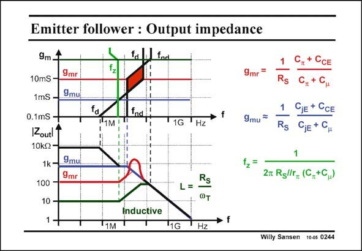
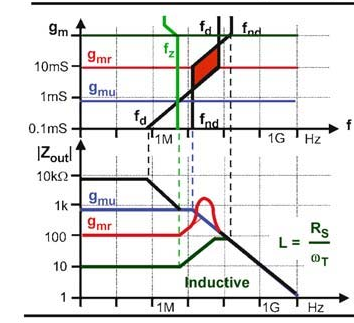

# SANSEN-0244 · 射极跟随器的输出阻抗

章节：02 放大器、源极跟随器与共源共栅级  
PDF 页：72；书本页：73；幻灯片编号：0244  
状态：representative_case_visually_reviewed



## Spectre 仿真

本推导组的代表模型已完成 Spectre 验证；覆盖范围以所列网表为准，未逐一搭建所有幻灯片电路。

[本组波形与仿真报告](../../simulations/ch02/index.html#10-emitter-hf)

## 第二章公式推导

增加基极电流与随跨导变动的扩散电容，标明教材中心跨导式的未解差异。

[完整 Markdown 解释](../../derivations/ch02/10-emitter-hf.md) · [排版公式网页](../../derivations/ch02/10-emitter-hf.html)

状态：derived_with_source_notes；SFG：not_needed。此组以微分、KCL 或矩阵即可说明机制，没有必要另画 SFG。

模型、近似与来源差异以新推导页为准；下方保留第一步的原始抽取。

## 对应教材讲解

### PDF 71 · 书本 72

Both kinds of peaking are even more pronounced in an emitter follower. Indeed, the pole-zero position diagram of the output impedance, with the transconductance as a parameter, shows

### PDF 72 · 书本 73

that around g complex mr poles occur again, leading to severe peaking in the Bode diagram. The current corresponding to this g should mr be avoided. Again the zero occurs at lower frequencies than both poles. As a result, for large currents, the output impedance first rises before it levels off and then decreases. It is severely inductive! Again a perfect first-order characteristic can be obtained by tuning the current to realize g . This is mu the transconductance where the zero cancels out the first pole. A wide band source follower at low current results with an output impedance which is resistive up tol high frequencies, and with value 1/g . mu Especially for bipolar transistor emitter followers, a buffer with purely resistive output impedance up to high frequencies is of added value in RF circuits, for example to be connected to a 50 V transmission line. This value of g depends mainly on the source resistance. For small resistances, the current mu may become excessive.

## 已核对的抽取

射极跟随器同样可能出现复极点峰化与感性输出阻抗；正文指出这些效应比源极跟随器更明显。

- `L=\frac{R_S}{\omega_T}` — 原图给出的等效感性量表达式。



### 曲线结论

- g_m 接近 g_mr 时输出阻抗严重峰化。
- 较大电流时阻抗先上升、再平坦、最后下降，呈现强烈感性。
- 调整至 g_mu 可使零点与第一极点相消，在较宽带段得到电阻性输出。

### 条件与近似注记

- 原文指出小 R_S 可能使达成 g_mu 所需电流过大。
- 本笔仅核对曲线结论与等效电感式；其他公式仍以原图为准。

### 连接关系

- 此页本身没有完整电路；组件定义沿用同节射极跟随器模型。

## 公式／性能结论候选摘录

以下为规则截取的原文，尚未逐项判读。

- PDF 72: As a result, for large currents, the output impedance first rises before it levels off and then decreases.
- PDF 72: This value of g depends mainly on the source resistance.

## 曲线结论候选摘录

以下为规则截取的原文，尚未逐项判读。

- PDF 71: Both kinds of peaking are even more pronounced in an emitter follower.
- PDF 72: that around g complex mr poles occur again, leading to severe peaking in the Bode diagram.
- PDF 72: Again a perfect first-order characteristic can be obtained by tuning the current to realize g .

## 原文条件与近似候选摘录

以下为规则截取的原文，尚未逐项判读。

（未由规则找到；不代表原页没有此类内容。）

## 幻灯片 OCR（未校正）

```text
Emitter follower : Output impedance
9m.
9mr
10mS -
1mS -
9muil
0.1mS -
IZoutl1
10k-
1k -
100 -
9mul
9mr
10 -
f. fad
fz
fa
11M
11G
THz
L=
@т
9mг
9mu
f,=
Rs
1
Rs
CjE + CCE
GjE + CH
2m Rgllr_ (C,+C)
Inductive
"1G
Hz
Willy Sansen
10-05 0244
```

数学上下标、分数及正负号以原图为准。电路图已保留；未核对的连接不输出成可仿真 netlist。
