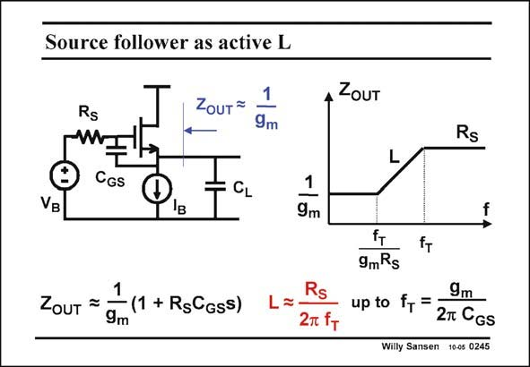

# SANSEN-0245 · Source follower as active L

章节：02 放大器、源极跟随器与共源共栅级  
PDF 页：72；书本页：73；幻灯片编号：0245  
状态：unreviewed



## Spectre 仿真

本推导组的代表模型已完成 Spectre 验证；覆盖范围以所列网表为准，未逐一搭建所有幻灯片电路。

[本组波形与仿真报告](../../simulations/ch02/index.html#11-active-inductors)

## 第二章公式推导

从跟随器输出阻抗作低频展开，再核对差分端口与半电路的两倍关系。

[完整 Markdown 解释](../../derivations/ch02/11-active-inductors.md) · [排版公式网页](../../derivations/ch02/11-active-inductors.html)

状态：derived_with_source_notes；SFG：not_needed。此组以微分、KCL 或矩阵即可说明机制，没有必要另画 SFG。

模型、近似与来源差异以新推导页为准；下方保留第一步的原始抽取。

## 对应教材讲解

### PDF 72 · 书本 73

The inductive output impedance of both source and emitter followers can be used wherever an inductor is required. They have been used in oscillators but also to add a bit of peaking to an amplifier, to compensate for an early roll-off because of all the transistor capacitances. In its simplest form, such output inductor can be obtained by a source follower with high source resistor R and biased at a large S DC current I . The inductor has a value given in this slide. B The output impedance is only inductive for frequencies between f /(g R ) and f itself. The T m S T quality factor of this inductor is low however, as its series resistor is R itself. S At low frequencies the output resistance is obviously 1/g . For higher frequencies, capacitance m

### PDF 73 · 书本 74

C acts as a short, As a result the output resistance gradually becomes R . When R is larger GS S S than 1/g , the output impedance must therefore rise, which causes the output impedance to be m inductive. Obviously, if R were equal to 1/g , the output impedance would be resistive up to S m very high frequencies. The output impedance is thus inductive because R is much larger than 1/g . S m

## 公式／性能结论候选摘录

以下为规则截取的原文，尚未逐项判读。

- PDF 73: C acts as a short, As a result the output resistance gradually becomes R .
- PDF 73: When R is larger GS S S than 1/g , the output impedance must therefore rise, which causes the output impedance to be m inductive.
- PDF 73: Obviously, if R were equal to 1/g , the output impedance would be resistive up to S m very high frequencies.
- PDF 73: The output impedance is thus inductive because R is much larger than 1/g .

## 曲线结论候选摘录

以下为规则截取的原文，尚未逐项判读。

- PDF 72: They have been used in oscillators but also to add a bit of peaking to an amplifier, to compensate for an early roll-off because of all the transistor capacitances.

## 原文条件与近似候选摘录

以下为规则截取的原文，尚未逐项判读。

- PDF 73: The output impedance is thus inductive because R is much larger than 1/g .

## 幻灯片 OCR（未校正）

```text
Source follower as active L
Rs
1
ZouT -
9m
ZoUT
Rs
CGS
CL
VB
1
9m
1
ZouT =
- (1 + RgCGss)
9m
Rs
2т fт
fT
9mRs
fT
9m
up to fr =
2T CGs
Willy Sansen 10-05 0245
```

数学上下标、分数及正负号以原图为准。电路图已保留；未核对的连接不输出成可仿真 netlist。
