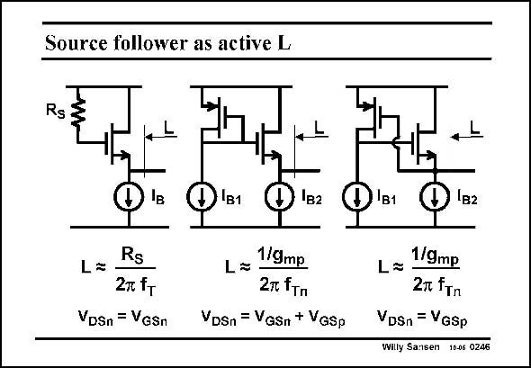

# SANSEN-0246 · Source follower as active L

章节：02 放大器、源极跟随器与共源共栅级  
PDF 页：73；书本页：74；幻灯片编号：0246  
状态：unreviewed



## Spectre 仿真

本推导组的代表模型已完成 Spectre 验证；覆盖范围以所列网表为准，未逐一搭建所有幻灯片电路。

[本组波形与仿真报告](../../simulations/ch02/index.html#11-active-inductors)

## 第二章公式推导

从跟随器输出阻抗作低频展开，再核对差分端口与半电路的两倍关系。

[完整 Markdown 解释](../../derivations/ch02/11-active-inductors.md) · [排版公式网页](../../derivations/ch02/11-active-inductors.html)

状态：derived_in_stated_model；SFG：not_needed。此组以微分、KCL 或矩阵即可说明机制，没有必要另画 SFG。

模型、近似与来源差异以新推导页为准；下方保留第一步的原始抽取。

## 对应教材讲解

### PDF 73 · 书本 74

Many other circuits are possible to realize this high value of source resistor R . S A diode connected MOST can be taken, as in the circuit in the middle. The source resistor then has the value R =1/g . S mp The preferred circuit is on the right. This is a feedback circuit, in which the drain of the pMOST is still shorted to its gate, over a nMOST source follower. As a result, the source resistor R still S equals 1/g . mp The advantage of the latter circuit is that the voltage drop across is lower than for the middle circuit. It is only V . This is obviously important for deep submicron CMOS circuits, where DSn the supply voltage is little over 1 V.

## 公式／性能结论候选摘录

以下为规则截取的原文，尚未逐项判读。

- PDF 73: As a result, the source resistor R still S equals 1/g . mp The advantage of the latter circuit is that the voltage drop across is lower than for the middle circuit.

## 曲线结论候选摘录

以下为规则截取的原文，尚未逐项判读。

（未由规则找到；不代表原页没有此类内容。）

## 原文条件与近似候选摘录

以下为规则截取的原文，尚未逐项判读。

（未由规则找到；不代表原页没有此类内容。）

## 幻灯片 OCR（未校正）

```text
Source follower as active L
B1
'B2
Rs
L=
27 fт
VDSn = GSn
L=
1/9mp
2т fтп
VDSn = Vgsn + Vgsp
'B1
1B2
L=
1/9mg
2m fTn
VDSn = VGSp
Willy Sansen 16-06 0246
```

数学上下标、分数及正负号以原图为准。电路图已保留；未核对的连接不输出成可仿真 netlist。
