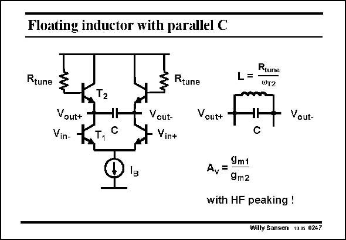

# SANSEN-0247 · Floating inductor with parallel C

章节：02 放大器、源极跟随器与共源共栅级  
PDF 页：73；书本页：74；幻灯片编号：0247  
状态：unreviewed



## Spectre 仿真

本推导组的代表模型已完成 Spectre 验证；覆盖范围以所列网表为准，未逐一搭建所有幻灯片电路。

[本组波形与仿真报告](../../simulations/ch02/index.html#11-active-inductors)

## 第二章公式推导

从跟随器输出阻抗作低频展开，再核对差分端口与半电路的两倍关系。

[完整 Markdown 解释](../../derivations/ch02/11-active-inductors.md) · [排版公式网页](../../derivations/ch02/11-active-inductors.html)

状态：derived_with_source_notes；SFG：not_needed。此组以微分、KCL 或矩阵即可说明机制，没有必要另画 SFG。

模型、近似与来源差异以新推导页为准；下方保留第一步的原始抽取。

## 对应教材讲解

### PDF 73 · 书本 74

A good example of a wideband (differential) amplifier is shown in this slide. The capacitances from the output terminals to ground cause a reduction in bandwidth. Adding resistors in the bases of the top bipolar transistors T , causes their 2 output impedances to be inductive, with value L. As a result, peaking occurs, increasing the bandwidth. This bandwidth increase can thus be tuned by means of these base resistors. The gain itself is simply given by the ratio of the two transconductances. Its value is low, which is typical for wideband amplifiers, e.g. for the transimpedance input amplifier of an optical receiver.

## 公式／性能结论候选摘录

以下为规则截取的原文，尚未逐项判读。

- PDF 73: The capacitances from the output terminals to ground cause a reduction in bandwidth.
- PDF 73: As a result, peaking occurs, increasing the bandwidth.
- PDF 73: This bandwidth increase can thus be tuned by means of these base resistors.
- PDF 73: The gain itself is simply given by the ratio of the two transconductances.

## 曲线结论候选摘录

以下为规则截取的原文，尚未逐项判读。

- PDF 73: As a result, peaking occurs, increasing the bandwidth.

## 原文条件与近似候选摘录

以下为规则截取的原文，尚未逐项判读。

（未由规则找到；不代表原页没有此类内容。）

## 幻灯片 OCR（未校正）

```text
Floating inductor with parallel C
Rtune
T2
Vout+
Vin-
T1
Rtune
Vout-
Vin+
Rtune
L=•
WT2
Vout+
Vout-
9m1
A,=
9m2
with HF peaking !
Willy Sanser 10.05 0247
```

数学上下标、分数及正负号以原图为准。电路图已保留；未核对的连接不输出成可仿真 netlist。
