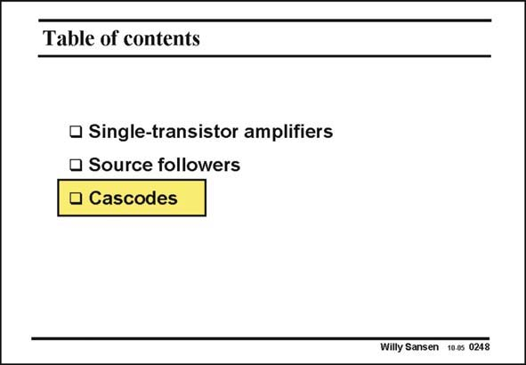

# SANSEN-0248 · Table of contents

章节：02 放大器、源极跟随器与共源共栅级  
PDF 页：74；书本页：75；幻灯片编号：0248  
状态：unreviewed



## 第二章公式推导

共栅与共源共栅级部分的过渡页；相应推导见第 12–18 组。

[完整 Markdown 解释](../../derivations/ch02/00-conventions.md) · [排版公式网页](../../derivations/ch02/00-conventions.html)

状态：context_reviewed_no_independent_derivation；SFG：not_applicable。本页为章节脉络，无独立小信号模型需建图。

模型、近似与来源差异以新推导页为准；下方保留第一步的原始抽取。

## 对应教材讲解

### PDF 74 · 书本 75

With a single transistor, we can make amplifiers, source followers and also cascodes. If we do not consider transistors used as switches, we now have the third and last single-transistor circuit possible. Later, we will combine these three elementary single-transistor transistors to two or three elementary two-transistor circuits. Most analog circuits are built up by means of these single-and two transistor circuits. A thorough understanding of these elementary blocks is therefore of vital importance.

## 公式／性能结论候选摘录

以下为规则截取的原文，尚未逐项判读。

- PDF 74: A thorough understanding of these elementary blocks is therefore of vital importance.

## 曲线结论候选摘录

以下为规则截取的原文，尚未逐项判读。

（未由规则找到；不代表原页没有此类内容。）

## 原文条件与近似候选摘录

以下为规则截取的原文，尚未逐项判读。

（未由规则找到；不代表原页没有此类内容。）

## 幻灯片 OCR（未校正）

```text
Table of contents
• Single-transistor amplifiers
• Source followers
• Cascodes
Willy Sansen 10.05 0248
```

数学上下标、分数及正负号以原图为准。电路图已保留；未核对的连接不输出成可仿真 netlist。
