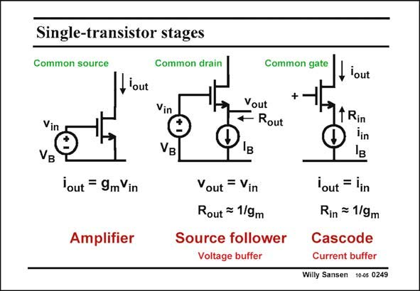

# SANSEN-0249 · Single-transistor stages

章节：02 放大器、源极跟随器与共源共栅级  
PDF 页：74；书本页：75；幻灯片编号：0249  
状态：unreviewed



## Spectre 仿真

本推导组的代表模型已完成 Spectre 验证；覆盖范围以所列网表为准，未逐一搭建所有幻灯片电路。

[本组波形与仿真报告](../../simulations/ch02/index.html#12-common-gate)

## 第二章公式推导

先固定测试电流方向与负载端接，再由同一组 KCL 得三种端口量。

[完整 Markdown 解释](../../derivations/ch02/12-common-gate.md) · [排版公式网页](../../derivations/ch02/12-common-gate.html)

状态：derived_in_stated_model；SFG：not_needed。此组以微分、KCL 或矩阵即可说明机制，没有必要另画 SFG。

模型、近似与来源差异以新推导页为准；下方保留第一步的原始抽取。

## 对应教材讲解

### PDF 74 · 书本 75

Once more, an overview of the three single-transistor stages is given in this slide. The first one, the amplifier, converts an input voltage into an output current, by means of transconductance g . m The second stage is a source follower. It is biased by a DC current source I . B The voltage gain is unity. This is why a source follower is called a voltage buffer. The third stage is a cascode. It is also biased by a DC current source I . A small-signal input current is superimposed B on the source current. The output is at the drain. Since no current can escape, the current gain is not unity. This is why a cascode is also called a current buffer. It is a buffer because its input resistance is small but its output resistance is high. This stage will therefore be used to transfer a current accurately from a low impedance to a higher one. This is required for current output sensors, such a photodiodes and potentiostatic sensors. Their internal impedances can be hundreds of MV’s, and we need an impedance converter to reduce values! Note that the input impedance of a cascode is the same as the output impedance of a source follower!

## 公式／性能结论候选摘录

以下为规则截取的原文，尚未逐项判读。

- PDF 74: B The voltage gain is unity.
- PDF 74: Since no current can escape, the current gain is not unity.
- PDF 74: This stage will therefore be used to transfer a current accurately from a low impedance to a higher one.

## 曲线结论候选摘录

以下为规则截取的原文，尚未逐项判读。

（未由规则找到；不代表原页没有此类内容。）

## 原文条件与近似候选摘录

以下为规则截取的原文，尚未逐项判读。

（未由规则找到；不代表原页没有此类内容。）

## 幻灯片 OCR（未校正）

```text
Single-transistor stages
Common source
Common drain
Common gate
lout
Vin
VB
Vin
®
VB
Vout
Rout
, lout
1 Rin
'out = 9mVin
Amplifier
Vout = Vin
Rout = 1/9m
Source follower
Voltage buffer
lout = lin
Rin = 1/9m
Cascode
Current buffer
Willy Sansen 10-05 0249
```

数学上下标、分数及正负号以原图为准。电路图已保留；未核对的连接不输出成可仿真 netlist。
