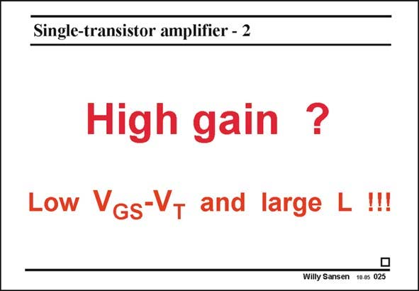

# SANSEN-025 · 单管放大器：增益与尺寸

章节：02 放大器、源极跟随器与共源共栅级  
PDF 页：52；书本页：53；幻灯片编号：025  
状态：representative_case_visually_reviewed



## Spectre 仿真

本推导组的代表模型已完成 Spectre 验证；覆盖范围以所列网表为准，未逐一搭建所有幻灯片电路。

[本组波形与仿真报告](../../simulations/ch02/index.html#01-intrinsic-gain)

## 第二章公式推导

由漏极 KCL 与器件电流微分得到增益，再比较固定过驱动电压下的 MOS／BJT。

[完整 Markdown 解释](../../derivations/ch02/01-intrinsic-gain.md) · [排版公式网页](../../derivations/ch02/01-intrinsic-gain.html)

状态：derived_in_stated_model；SFG：not_needed。此组以微分、KCL 或矩阵即可说明机制，没有必要另画 SFG。

模型、近似与来源差异以新推导页为准；下方保留第一步的原始抽取。

## 对应教材讲解

### PDF 51 · 书本 52

These are really important conclusions. Large gain A can only be achieved by choosing large v channel length L and by making V −V as small as possible. GS T As a result, the minimum channel length is never used in an analog amplifier. Usually we limit the value of L to at least 4–5 times the minimum value.

### PDF 52 · 书本 53

Also, we take the take the value of V −V as small GS T as possible. A typical value is 0.15–0.2 V. We cannot go much lower as we then end up in the weak inversion region. The absolute value of the current and the transconductance then become so small that the noise becomes too large. Noise will be explained in detail in Chapter 3. Small values of the current inevitably lead to larger noise and smaller signalto-noise ratios (SNR). For SNR values below 40 dB, weak inversion can be used. Sensor interface and biomedical preamplifiers are comfortable with this. Communication amplifiers usually require more than 70 dB SNR. As a result we have to stay in the region between weak and strong inversion. A value of V −V GS T between 0.15 V and 0.2 V is therefore a good compromise.

## 已核对的抽取

本页的设计结论是以较长沟道及较小过驱动电压提高增益；正文补充这会受到电流、噪声与信噪比需求限制。正文给的尺寸与电压是本书情境下的建议值，不能直接当作所有工艺的规则。


### 曲线结论


### 条件与近似注记

- 原文建议 L 至少约为最小沟道长度的 4–5 倍，V_GS−V_T 约 0.15–0.2 V。
- 原文提醒再降低过驱动电压会进入弱反转，并讨论较小电流对噪声及 SNR 的取舍。

### 连接关系


## 公式／性能结论候选摘录

以下为规则截取的原文，尚未逐项判读。

- PDF 51: Large gain A can only be achieved by choosing large v channel length L and by making V −V as small as possible.
- PDF 51: GS T As a result, the minimum channel length is never used in an analog amplifier.
- PDF 51: Usually we limit the value of L to at least 4–5 times the minimum value.
- PDF 52: As a result we have to stay in the region between weak and strong inversion.
- PDF 52: A value of V −V GS T between 0.15 V and 0.2 V is therefore a good compromise.

## 曲线结论候选摘录

以下为规则截取的原文，尚未逐项判读。

（未由规则找到；不代表原页没有此类内容。）

## 原文条件与近似候选摘录

以下为规则截取的原文，尚未逐项判读。

（未由规则找到；不代表原页没有此类内容。）

## 幻灯片 OCR（未校正）

```text
Single-transistor amplifier - 2
High gain ?
Low Vgs-VT and large L !!!
Willy Sansen 10.05 025
```

数学上下标、分数及正负号以原图为准。电路图已保留；未核对的连接不输出成可仿真 netlist。
