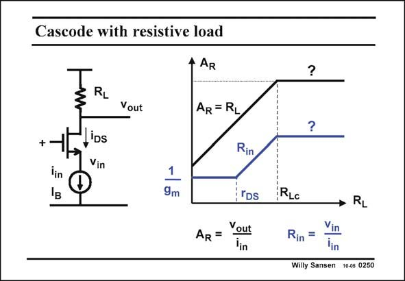

# SANSEN-0250 · Cascode with resistive load

章节：02 放大器、源极跟随器与共源共栅级  
PDF 页：75；书本页：76；幻灯片编号：0250  
状态：unreviewed



## Spectre 仿真

本推导组的代表模型已完成 Spectre 验证；覆盖范围以所列网表为准，未逐一搭建所有幻灯片电路。

[本组波形与仿真报告](../../simulations/ch02/index.html#12-common-gate)

## 第二章公式推导

先固定测试电流方向与负载端接，再由同一组 KCL 得三种端口量。

[完整 Markdown 解释](../../derivations/ch02/12-common-gate.md) · [排版公式网页](../../derivations/ch02/12-common-gate.html)

状态：derived_in_stated_model；SFG：not_needed。此组以微分、KCL 或矩阵即可说明机制，没有必要另画 SFG。

模型、近似与来源差异以新推导页为准；下方保留第一步的原始抽取。

## 对应教材讲解

### PDF 75 · 书本 76

Most often, the output current of a cascode is converted into a voltage by means of a resistance R . L We thus obtain a currentto-voltage converter or transresistance amplifier. The higher the resistance R L the higher the gain, since the transresistance v /i =A out in R is simply R itself. This is L true whilst R is not too L high. For not too high values of R , the input resistance L v /i =R is then low, or in in in simply 1/g . m We will try to make the value of R as high as possible, in order to achieve a high gain. This L can be done by cascoding a few transistors as a load. The question then is, what will the gain be? Indeed, for very high values of R , it is not clear what the gain will be. For example, for L infinite R , the current i cannot flow any more. What can the ratio v /i be? L in out in

## 公式／性能结论候选摘录

以下为规则截取的原文，尚未逐项判读。

- PDF 75: L We thus obtain a currentto-voltage converter or transresistance amplifier.
- PDF 75: The higher the resistance R L the higher the gain, since the transresistance v /i =A out in R is simply R itself.
- PDF 75: For not too high values of R , the input resistance L v /i =R is then low, or in in in simply 1/g . m We will try to make the value of R as high as possible, in order to achieve a high gain.
- PDF 75: The question then is, what will the gain be?
- PDF 75: Indeed, for very high values of R , it is not clear what the gain will be.

## 曲线结论候选摘录

以下为规则截取的原文，尚未逐项判读。

（未由规则找到；不代表原页没有此类内容。）

## 原文条件与近似候选摘录

以下为规则截取的原文，尚未逐项判读。

（未由规则找到；不代表原页没有此类内容。）

## 幻灯片 OCR（未校正）

```text
Cascode with resistive load
+
lin
-
RL
Vout
iDs
Vin
4 AR
1
9m
AR = RL
Rin
rDS
AR= Yout
5
?
?
RLc
→ RL
Rin = Vin
lin
Willy Sansen 10-05 0250
```

数学上下标、分数及正负号以原图为准。电路图已保留；未核对的连接不输出成可仿真 netlist。
