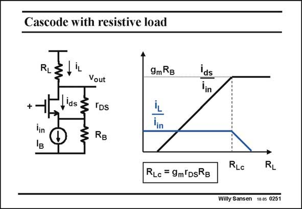

# SANSEN-0251 · Cascode with resistive load

章节：02 放大器、源极跟随器与共源共栅级  
PDF 页：75；书本页：76；幻灯片编号：0251  
状态：unreviewed



## Spectre 仿真

本推导组的代表模型已完成 Spectre 验证；覆盖范围以所列网表为准，未逐一搭建所有幻灯片电路。

[本组波形与仿真报告](../../simulations/ch02/index.html#12-common-gate)

## 第二章公式推导

先固定测试电流方向与负载端接，再由同一组 KCL 得三种端口量。

[完整 Markdown 解释](../../derivations/ch02/12-common-gate.md) · [排版公式网页](../../derivations/ch02/12-common-gate.html)

状态：derived_in_stated_model；SFG：not_needed。此组以微分、KCL 或矩阵即可说明机制，没有必要另画 SFG。

模型、近似与来源差异以新推导页为准；下方保留第一步的原始抽取。

## 对应教材讲解

### PDF 75 · 书本 76

The only possible way to respect the laws of Kirchoff, is to add either an output resistance to the input current source or to limit the load resistor to finite values. Let us see what happens when we make the load resistor infinity and we add an output resistance R in B parallel with the input current source. Moreover, we separate the output resistor r from the transistor itself, DS to determine where the currents are actually flowing. Two currents are now calculated, the current i in the transistor itself and the current through ds the load resistor i . L This latter current i is constant as imposed by the input current source. However, if R is L L larger than a specific value R , then this current has to go to zero! Lc The transistor current i on the other hand, increases with the load resistor, to become ds constant once R is larger than R . The transistor thus amplifies the input current to fairly L Lc large values! Normally, g R is much larger than unity! m B

### PDF 76 · 书本 77

Note that R contains all the parameters involved, the ones of the transistor such as g and Lc m r but also R . It contains the actual gain g r of the transistor itself. DS B m DS

## 公式／性能结论候选摘录

以下为规则截取的原文，尚未逐项判读。

- PDF 75: The only possible way to respect the laws of Kirchoff, is to add either an output resistance to the input current source or to limit the load resistor to finite values.
- PDF 75: Lc The transistor current i on the other hand, increases with the load resistor, to become ds constant once R is larger than R .
- PDF 75: The transistor thus amplifies the input current to fairly L Lc large values!
- PDF 76: It contains the actual gain g r of the transistor itself.

## 曲线结论候选摘录

以下为规则截取的原文，尚未逐项判读。

（未由规则找到；不代表原页没有此类内容。）

## 原文条件与近似候选摘录

以下为规则截取的原文，尚未逐项判读。

- PDF 75: Normally, g R is much larger than unity! m B

## 幻灯片 OCR（未校正）

```text
Cascode with resistive load
RL
9m RB
ids
lin
ІB
Vout
ids& IDs
RB
RLc = 9m DsRB
RLc
RL
Willy Sansen 10.0s 0251
```

数学上下标、分数及正负号以原图为准。电路图已保留；未核对的连接不输出成可仿真 netlist。
