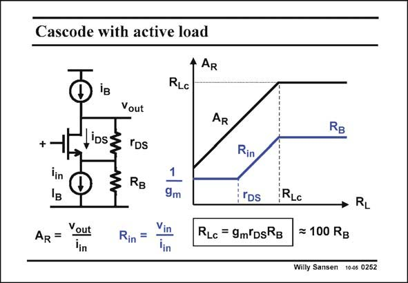

# SANSEN-0252 · Cascode with active load

章节：02 放大器、源极跟随器与共源共栅级  
PDF 页：76；书本页：77；幻灯片编号：0252  
状态：unreviewed



## Spectre 仿真

本推导组的代表模型已完成 Spectre 验证；覆盖范围以所列网表为准，未逐一搭建所有幻灯片电路。

[本组波形与仿真报告](../../simulations/ch02/index.html#12-common-gate)

## 第二章公式推导

先固定测试电流方向与负载端接，再由同一组 KCL 得三种端口量。

[完整 Markdown 解释](../../derivations/ch02/12-common-gate.md) · [排版公式网页](../../derivations/ch02/12-common-gate.html)

状态：derived_in_stated_model；SFG：not_needed。此组以微分、KCL 或矩阵即可说明机制，没有必要另画 SFG。

模型、近似与来源差异以新推导页为准；下方保留第一步的原始抽取。

## 对应教材讲解

### PDF 76 · 书本 77

Let us now look again at the actual transresistance A R and at the input resistance R . in For very large values of the load resistor, A R becomes R itself. The gain Lc A includes the gain of the R transistor g r , and is m DS therefore quite high. It is the highest transresistance gain that can be achieved by a single-transistor cascode. For that purpose, the load resistor must be larger than that very same transresistance R . Lc For these large load resistances, the input resistance of the transistor itself becomes infinity. This is expected as the load resistor is also infinity – no current can pass through the transistor. The resistance seen by the input current source thus becomes resistor R , which is actually its B output resistance. It is thus by no means small, as suggested by the 1/g low load resistances. m

## 公式／性能结论候选摘录

以下为规则截取的原文，尚未逐项判读。

- PDF 76: The gain Lc A includes the gain of the R transistor g r , and is m DS therefore quite high.
- PDF 76: It is the highest transresistance gain that can be achieved by a single-transistor cascode.
- PDF 76: The resistance seen by the input current source thus becomes resistor R , which is actually its B output resistance.
- PDF 76: It is thus by no means small, as suggested by the 1/g low load resistances. m

## 曲线结论候选摘录

以下为规则截取的原文，尚未逐项判读。

（未由规则找到；不代表原页没有此类内容。）

## 原文条件与近似候选摘录

以下为规则截取的原文，尚未逐项判读。

（未由规则找到；不代表原页没有此类内容。）

## 幻灯片 OCR（未校正）

```text
Cascode with active load
4 AR
+
lin
D iB
Vout
LiDsZ rDs
RB
RLc
AR
RB
AR =
Yout
Rin =
1
9m
Vin
lin
Rin
rDs
RLc = 9m DsRB
RLc
RL
= 100 RB
Willy Sansen 10-05 0252
```

数学上下标、分数及正负号以原图为准。电路图已保留；未核对的连接不输出成可仿真 netlist。
