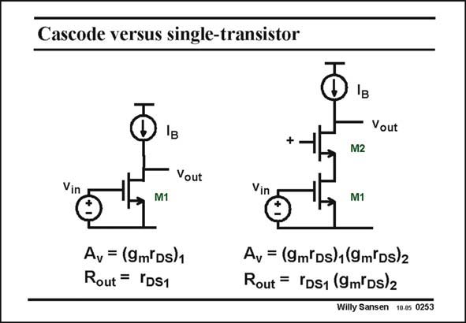

# SANSEN-0253 · Cascode versus single-transistor

章节：02 放大器、源极跟随器与共源共栅级  
PDF 页：76；书本页：77；幻灯片编号：0253  
状态：unreviewed



## Spectre 仿真

本推导组的代表模型已完成 Spectre 验证；覆盖范围以所列网表为准，未逐一搭建所有幻灯片电路。

[本组波形与仿真报告](../../simulations/ch02/index.html#13-cascode)

## 第二章公式推导

求有效跨导、输出阻抗、主极点与 GBW，逐步回到两个本征增益的乘积。

[完整 Markdown 解释](../../derivations/ch02/13-cascode.md) · [排版公式网页](../../derivations/ch02/13-cascode.html)

状态：derived_in_stated_model；SFG：not_needed。此组以微分、KCL 或矩阵即可说明机制，没有必要另画 SFG。

模型、近似与来源差异以新推导页为准；下方保留第一步的原始抽取。

## 对应教材讲解

### PDF 76 · 书本 77

Substituting the input current source by another transistor, yields the twotransistor cascode, shown at the right. Since a transistor acts as a current source, with output resistor r , DS it can take the place of the input current source with output resistor R . The B maximum gain (for very large resistive load) is this given in this slide, This shows that the total voltage gain now equals the product of the gains of both transistors. Obviously this is a result of the increase of the output resistance. For one single transistor (left), this output impedance is only r but for a transistor with another r in its Source (right), DS1 DS it is r g r , as shown in this slide. DS1 m2 DS2

### PDF 77 · 书本 78

The larger the output impedance, the larger the gain. Putting a cascode on top of a single-transistor amplifier is one of the most common design techniques to increase the gain. It will be used whenever we require more gain! Other gain techniques will be gain boosting, bootstrapping and current cancellation and starving schemes.

## 公式／性能结论候选摘录

以下为规则截取的原文，尚未逐项判读。

- PDF 76: The B maximum gain (for very large resistive load) is this given in this slide, This shows that the total voltage gain now equals the product of the gains of both transistors.
- PDF 76: Obviously this is a result of the increase of the output resistance.
- PDF 77: The larger the output impedance, the larger the gain.
- PDF 77: Putting a cascode on top of a single-transistor amplifier is one of the most common design techniques to increase the gain.
- PDF 77: It will be used whenever we require more gain!
- PDF 77: Other gain techniques will be gain boosting, bootstrapping and current cancellation and starving schemes.

## 曲线结论候选摘录

以下为规则截取的原文，尚未逐项判读。

（未由规则找到；不代表原页没有此类内容。）

## 原文条件与近似候选摘录

以下为规则截取的原文，尚未逐项判读。

（未由规则找到；不代表原页没有此类内容。）

## 幻灯片 OCR（未校正）

```text
Cascode versus single-transistor
Iв
+
Iв
- Vout
M2
Vout
Vin
M1
Vin
M1
Av = (9m'Ds)1
Rout = IDS1
Ay = (9m'Ds)1(9m(Ds)2
Rout = YDS1 (9m'Ds)2
Willy Sansen 10.05 0253
```

数学上下标、分数及正负号以原图为准。电路图已保留；未核对的连接不输出成可仿真 netlist。
