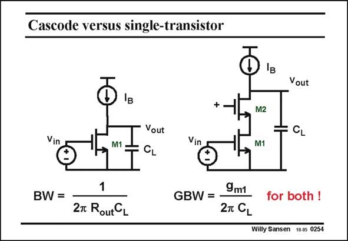

# SANSEN-0254 · Cascode versus single-transistor

章节：02 放大器、源极跟随器与共源共栅级  
PDF 页：77；书本页：78；幻灯片编号：0254  
状态：unreviewed



## Spectre 仿真

本推导组的代表模型已完成 Spectre 验证；覆盖范围以所列网表为准，未逐一搭建所有幻灯片电路。

[本组波形与仿真报告](../../simulations/ch02/index.html#13-cascode)

## 第二章公式推导

求有效跨导、输出阻抗、主极点与 GBW，逐步回到两个本征增益的乘积。

[完整 Markdown 解释](../../derivations/ch02/13-cascode.md) · [排版公式网页](../../derivations/ch02/13-cascode.html)

状态：derived_in_stated_model；SFG：not_needed。此组以微分、KCL 或矩阵即可说明机制，没有必要另画 SFG。

模型、近似与来源差异以新推导页为准；下方保留第一步的原始抽取。

## 对应教材讲解

### PDF 77 · 书本 78

Now that we know that a cascode enhances the gain considerably, we would like to know up tol what frequencies, a cascode manages to do this. When the output capacitance is the main capacitance, the GBW is as given in this slide. The Bandwidth for both cases must be different, as the output resistances differ widely. The GBW is the same for both, however. Indeed, in the case with a cascode, the gain is much larger but the bandwidth is equally lower. The GBW is thus the same. This is shown next.

## 公式／性能结论候选摘录

以下为规则截取的原文，尚未逐项判读。

- PDF 77: Now that we know that a cascode enhances the gain considerably, we would like to know up tol what frequencies, a cascode manages to do this.
- PDF 77: The Bandwidth for both cases must be different, as the output resistances differ widely.
- PDF 77: Indeed, in the case with a cascode, the gain is much larger but the bandwidth is equally lower.
- PDF 77: The GBW is thus the same.

## 曲线结论候选摘录

以下为规则截取的原文，尚未逐项判读。

（未由规则找到；不代表原页没有此类内容。）

## 原文条件与近似候选摘录

以下为规则截取的原文，尚未逐项判读。

- PDF 77: Indeed, in the case with a cascode, the gain is much larger but the bandwidth is equally lower.

## 幻灯片 OCR（未校正）

```text
Cascode versus single-transistor
Vout
+.
M2
Vin
M1
Vout
CL
Vin
M1
= GL
BW =
1
27 RoutCL
9m1
GBW = -
2T CL
for both
Willy Sansen 10.05 0254
```

数学上下标、分数及正负号以原图为准。电路图已保留；未核对的连接不输出成可仿真 netlist。
