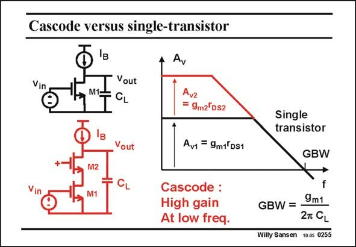

# SANSEN-0255 · Cascode versus single-transistor

章节：02 放大器、源极跟随器与共源共栅级  
PDF 页：77；书本页：78；幻灯片编号：0255  
状态：unreviewed



## Spectre 仿真

本推导组的代表模型已完成 Spectre 验证；覆盖范围以所列网表为准，未逐一搭建所有幻灯片电路。

[本组波形与仿真报告](../../simulations/ch02/index.html#13-cascode)

## 第二章公式推导

求有效跨导、输出阻抗、主极点与 GBW，逐步回到两个本征增益的乘积。

[完整 Markdown 解释](../../derivations/ch02/13-cascode.md) · [排版公式网页](../../derivations/ch02/13-cascode.html)

状态：derived_in_stated_model；SFG：not_needed。此组以微分、KCL 或矩阵即可说明机制，没有必要另画 SFG。

模型、近似与来源差异以新推导页为准；下方保留第一步的原始抽取。

## 对应教材讲解

### PDF 77 · 书本 78

It is clear that a cascode enhances the gain at low frequencies. Compared to a singlestage amplifier, the gain at low frequencies is as large as the bandwidth is smaller. As a result the GBW is the same. This is only true if the load resistance is very high. In some wideband amplifiers, the load resistor is small, e.g. 50 V. In this case, the output resistance and the bandwidth are the same for both. The gain is also the same, but quite small, as is the GBW. In analog integrated circuits we normally use DC current sources as loads, in order to increase the gain. Therefore, we can conclude that such cascode stages only enhance the gain at low frequencies!

## 公式／性能结论候选摘录

以下为规则截取的原文，尚未逐项判读。

- PDF 77: It is clear that a cascode enhances the gain at low frequencies.
- PDF 77: Compared to a singlestage amplifier, the gain at low frequencies is as large as the bandwidth is smaller.
- PDF 77: As a result the GBW is the same.
- PDF 77: In this case, the output resistance and the bandwidth are the same for both.
- PDF 77: The gain is also the same, but quite small, as is the GBW.
- PDF 77: In analog integrated circuits we normally use DC current sources as loads, in order to increase the gain.
- PDF 77: Therefore, we can conclude that such cascode stages only enhance the gain at low frequencies!

## 曲线结论候选摘录

以下为规则截取的原文，尚未逐项判读。

（未由规则找到；不代表原页没有此类内容。）

## 原文条件与近似候选摘录

以下为规则截取的原文，尚未逐项判读。

（未由规则找到；不代表原页没有此类内容。）

## 幻灯片 OCR（未校正）

```text
Cascode versus single-transistor
Ay
Vout
CL
Avz
= 9m2'Ds2
Vout
Av = 9m1°DS1
M2
M1
Cascode :
High gain
At low freq.
Single
transistor
GBW
9m1
GBW = -
2T CL
Willy Sansen 10.05 0255
```

数学上下标、分数及正负号以原图为准。电路图已保留；未核对的连接不输出成可仿真 netlist。
