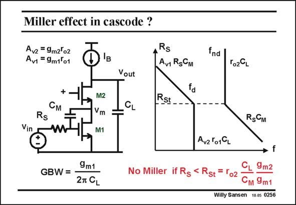

# SANSEN-0256 · Miller effect in cascode ?

章节：02 放大器、源极跟随器与共源共栅级  
PDF 页：78；书本页：79；幻灯片编号：0256  
状态：unreviewed



## Spectre 仿真

本推导组的代表模型已完成 Spectre 验证；覆盖范围以所列网表为准，未逐一搭建所有幻灯片电路。

[本组波形与仿真报告](../../simulations/ch02/index.html#14-cascode-miller)

## 第二章公式推导

保留三个电压节点，推导二阶分母及仍然存在的 RHP 零点。

[完整 Markdown 解释](../../derivations/ch02/14-cascode-miller.md) · [排版公式网页](../../derivations/ch02/14-cascode-miller.html)

状态：derived_with_source_notes；SFG：not_needed。此组以微分、KCL 或矩阵即可说明机制，没有必要另画 SFG。

模型、近似与来源差异以新推导页为准；下方保留第一步的原始抽取。

## 对应教材讲解

### PDF 78 · 书本 79

For cascode amplifiers with a DC current source as load, the gain is quite large. The gain across the input transistor is also large. The impedance at the point between both transistors is the output resistance r (or DS1 r ). The gain from the input o1 to the middle point is thus g r , which is the gain of m1 DS1 transistor M1. The Miller effect of M1 can thus also play a role, especially when source resistor R is higher. S The question is, which pole is now dominant, the one caused by C or the one caused by C ? L M Substitution of the transistors by their small-signal models (with g and r ), and calculation m DS of the total gain A , yields a second-order equation, the roots of which are easily found. They v are the two poles. They are plotted in a pole-zero position diagram with R as a variable as S shown in this slide. For low values of R , the load capacitance C is obviously dominant. This dominant-pole S L frequency f is simply determined by the load capacitance and the output resistance r g r d o2 m2 o1 or A r . There is a nondominant pole however at f , caused by time constant R C ! v2 o1 nd S M For high values of R however, the Miller effect of this capacitance C dominates. The S M dominant pole frequency f now decreases with increasing resistor R . d S The cross-over value of R is R . It is in the order of tens of MV’s as C is normally much S St SL larger than C , which is marginally more than C . M DG

## 公式／性能结论候选摘录

以下为规则截取的原文，尚未逐项判读。

- PDF 78: For cascode amplifiers with a DC current source as load, the gain is quite large.
- PDF 78: The gain across the input transistor is also large.
- PDF 78: The gain from the input o1 to the middle point is thus g r , which is the gain of m1 DS1 transistor M1.
- PDF 78: The Miller effect of M1 can thus also play a role, especially when source resistor R is higher.
- PDF 78: L M Substitution of the transistors by their small-signal models (with g and r ), and calculation m DS of the total gain A , yields a second-order equation, the roots of which are easily found.
- PDF 78: The S M dominant pole frequency f now decreases with increasing resistor R . d S The cross-over value of R is R .

## 曲线结论候选摘录

以下为规则截取的原文，尚未逐项判读。

- PDF 78: They are plotted in a pole-zero position diagram with R as a variable as S shown in this slide.

## 原文条件与近似候选摘录

以下为规则截取的原文，尚未逐项判读。

（未由规则找到；不代表原页没有此类内容。）

## 幻灯片 OCR（未校正）

```text
Miller effect in cascode ?
Avz = 9m2°o2
Avi =9m1*01
S
Av RgCM
fnd |
Vout
To2CL
+
См
Rs
Vin
M2
Vm
M1
Rst
CL
RsCm
Avz'019L
9m1
GBW= -
27 CL
No Miller if Rg < Rst =lo2
9m2
См 9m1
Willy Sansen 10.0s 0256
```

数学上下标、分数及正负号以原图为准。电路图已保留；未核对的连接不输出成可仿真 netlist。
