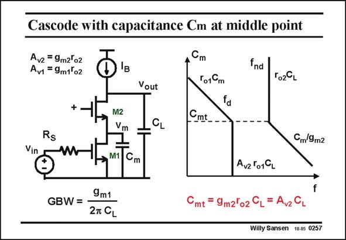

# SANSEN-0257 · Cascode with capacitance Cm at middle point

章节：02 放大器、源极跟随器与共源共栅级  
PDF 页：78；书本页：79；幻灯片编号：0257  
状态：unreviewed



## Spectre 仿真

本推导组的代表模型已完成 Spectre 验证；覆盖范围以所列网表为准，未逐一搭建所有幻灯片电路。

[本组波形与仿真报告](../../simulations/ch02/index.html#15-cascode-middle-cap)

## 第二章公式推导

由二节点矩阵求精确极点，再得到中间电容两个范围的渐近式。

[完整 Markdown 解释](../../derivations/ch02/15-cascode-middle-cap.md) · [排版公式网页](../../derivations/ch02/15-cascode-middle-cap.html)

状态：derived_in_stated_model；SFG：not_needed。此组以微分、KCL 或矩阵即可说明机制，没有必要另画 SFG。

模型、近似与来源差异以新推导页为准；下方保留第一步的原始抽取。

## 对应教材讲解

### PDF 78 · 书本 79

Another small capacitance may also play a role. Capacitance C from the m middle point to ground consists of C and C . They DS1 GS2 are not that small. Do they create a pole of importance? Again, we have only two capacitances, that yields a second-order equation, the roots of which give two poles. They are plotted in a pole-zero position diagram with C as a variable as m shown in this slide. For low values of C , the m

### PDF 79 · 书本 80

load capacitance C is obviously dominant again. Again, there is a non-dominant pole at f , L nd caused by time constant C /g . If g is similar to g , then this non-dominant pole is a lot m m2 m2 m1 higher than the GBW, as C is definitely a lot larger than C . L m For high values of C however, the time constant r C takes over. This is never likely to m o1 m occur, as for this region C must be larger than A C , which is a very high capacitance indeed. m v2 L

## 公式／性能结论候选摘录

以下为规则截取的原文，尚未逐项判读。

（未由规则找到；不代表原页没有此类内容。）

## 曲线结论候选摘录

以下为规则截取的原文，尚未逐项判读。

- PDF 78: They are plotted in a pole-zero position diagram with C as a variable as m shown in this slide.

## 原文条件与近似候选摘录

以下为规则截取的原文，尚未逐项判读。

（未由规则找到；不代表原页没有此类内容。）

## 幻灯片 OCR（未校正）

```text
Cascode with capacitance Cm at middle point
Avz =9m2'o2
Av1 = 9m1ºo2
Vout
Cm
T01Cm
Cmt__
fnd
To2CL
Rs
Vin
M2
Vm
M1
CL
Cm9m2
Cm
9m1
GBW= -
27 CL
Av2º019L
Cmt = 9m2lo2 CL= AvzCL
Willy Sansen 10.0s 0257
```

数学上下标、分数及正负号以原图为准。电路图已保留；未核对的连接不输出成可仿真 netlist。
