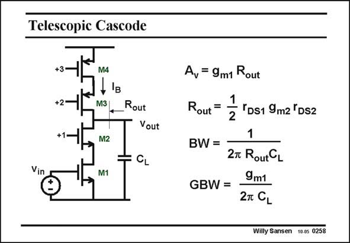

# SANSEN-0258 · Telescopic Cascode

章节：02 放大器、源极跟随器与共源共栅级  
PDF 页：79；书本页：80；幻灯片编号：0258  
状态：unreviewed



## Spectre 仿真

本推导组的代表模型已完成 Spectre 验证；覆盖范围以所列网表为准，未逐一搭建所有幻灯片电路。

[本组波形与仿真报告](../../simulations/ch02/index.html#16-telescopic-folded)

## 第二章公式推导

以支路输出电阻并联及电压裕量条件说明增益、摆幅与偏置电流分配。

[完整 Markdown 解释](../../derivations/ch02/16-telescopic-folded.md) · [排版公式网页](../../derivations/ch02/16-telescopic-folded.html)

状态：derived_in_stated_model；SFG：not_needed。此组以微分、KCL 或矩阵即可说明机制，没有必要另画 SFG。

模型、近似与来源差异以新推导页为准；下方保留第一步的原始抽取。

## 对应教材讲解

### PDF 79 · 书本 80

Ideal DC current sources do not exist, however. They have to be realized by means of transistors. Such a realization is shown in this slide. MOSTs M3 and M4 are used in series to give a DC current source with an high output resistance. If the output resistance of transistors M1/M2 is about the same as the output resistance of transistors M3/M4, then the total output resistance R is about half of out that. The bandwidth is obviously determined by the load capacitance. The GBW is then the same as for a single-transistor amplifier. This cascode configuration is called the Telescopic cascode, as all transistors are in series between supply line and ground. The main disadvantage of this cascode is that all transistors must be kept in the saturation region. This means that the minimum voltage v across each transistor is about V −V . If DS GS T we take V −V #0.2 V, we find that the maximum output voltage cannot be higher than the GS T supply voltage minus 0.4 V, and cannot be lower than 0.4 V. The maximum swing is thus 0.8 V lower than the supply voltage. This is a major loss for low supply voltages!

## 公式／性能结论候选摘录

以下为规则截取的原文，尚未逐项判读。

- PDF 79: The bandwidth is obviously determined by the load capacitance.
- PDF 79: The maximum swing is thus 0.8 V lower than the supply voltage.

## 曲线结论候选摘录

以下为规则截取的原文，尚未逐项判读。

（未由规则找到；不代表原页没有此类内容。）

## 原文条件与近似候选摘录

以下为规则截取的原文，尚未逐项判读。

- PDF 79: The main disadvantage of this cascode is that all transistors must be kept in the saturation region.

## 幻灯片 OCR（未校正）

```text
Telescopic Cascode
+3-
+2-
+1-
M4
M3
Vin
M2
M1
Rout
Vout
÷ CL
A, = 9m1 Rout
Rout =
1 "Ds1 9m2 'Ds2
2
1
BW =
27 RoutCL
GBW=
9m1
2T CL
Willy Sansen 10.05 0258
```

数学上下标、分数及正负号以原图为准。电路图已保留；未核对的连接不输出成可仿真 netlist。
