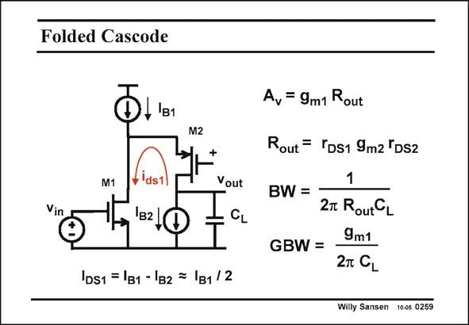

# SANSEN-0259 · Folded Cascode

章节：02 放大器、源极跟随器与共源共栅级  
PDF 页：80；书本页：81；幻灯片编号：0259  
状态：unreviewed



## Spectre 仿真

本推导组的代表模型已完成 Spectre 验证；覆盖范围以所列网表为准，未逐一搭建所有幻灯片电路。

[本组波形与仿真报告](../../simulations/ch02/index.html#16-telescopic-folded)

## 第二章公式推导

以支路输出电阻并联及电压裕量条件说明增益、摆幅与偏置电流分配。

[完整 Markdown 解释](../../derivations/ch02/16-telescopic-folded.md) · [排版公式网页](../../derivations/ch02/16-telescopic-folded.html)

状态：derived_in_stated_model；SFG：not_needed。此组以微分、KCL 或矩阵即可说明机制，没有必要另画 SFG。

模型、近似与来源差异以新推导页为准；下方保留第一步的原始抽取。

## 对应教材讲解

### PDF 79 · 书本 80

A folded cascode is used more often, because it has some advantages when used as a differential circuit (see Chapter 8). It is called ‘‘folded’’ because the cascode transistor is now a pMOST rather than a nMOST. The small-signal current i , which is determined by the input transistor ds1 M1, now flows upwards rather than downwards through the cascode transistor M2. Normally the biasing current I is equally split up over the two transistors, so that the DC B1 currents in both transistors are the same. The two current swings are also the same. All other specifications such as the gain, the bandwidth and the GBW, are the same as for a telescopic cascode. Note, however, that the current consumption is twice that of a telescopic cascode. Moreover, the maximum output voltage swing is about the same. If we realize the current

### PDF 80 · 书本 81

source I with one single B1 MOST and the current source I with two MOSTs B2 in series, then the maximum output swing is again 0.8 V smaller than the supply voltage. We now find a good argument to use a folded cascode rather than a telescopic one. Twice the current consumption for a folded cascode is a real drawback!!

## 公式／性能结论候选摘录

以下为规则截取的原文，尚未逐项判读。

- PDF 79: Normally the biasing current I is equally split up over the two transistors, so that the DC B1 currents in both transistors are the same.
- PDF 79: All other specifications such as the gain, the bandwidth and the GBW, are the same as for a telescopic cascode.

## 曲线结论候选摘录

以下为规则截取的原文，尚未逐项判读。

（未由规则找到；不代表原页没有此类内容。）

## 原文条件与近似候选摘录

以下为规则截取的原文，尚未逐项判读。

（未由规则找到；不代表原页没有此类内容。）

## 幻灯片 OCR（未校正）

```text
Folded Cascode
Oller
M2
M1
Vin
Ids1
'B2
Vout
CL
|DS1 = |в1 - 1в2 = |в1 /2
Av = 9m1 Rout
Rout = YDs1 9m2 'DS2
1
BW = -
2m RoutCL
GBW =
9m1
2T CL
Willy Sansen 10-05 0259
```

数学上下标、分数及正负号以原图为准。电路图已保留；未核对的连接不输出成可仿真 netlist。
